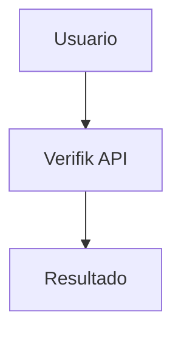

# Propuesta Verifik para COMPENSAR - Índice de Documentos

## 📚 Documentos Disponibles

Este directorio contiene la propuesta completa de Verifik para la implementación de una **Plataforma Omnicanal de Verificación y Autenticación de Identidad** para COMPENSAR.

---

## 📄 Documentos Principales

### 1. [COMPENSAR_EXECUTIVE_SUMMARY.md](./COMPENSAR_EXECUTIVE_SUMMARY.md)

**Resumen Ejecutivo** - Lectura recomendada para directivos y tomadores de decisión

**Contenido:**

-   ✅ Visión general de la propuesta
-   ✅ Cumplimiento de requerimientos (tabla resumen)
-   ✅ Casos de uso específicos para COMPENSAR
-   ✅ Propuesta de valor y ventajas competitivas
-   ✅ Métricas de rendimiento
-   ✅ Modelo comercial y precios
-   ✅ Plan de implementación (12 semanas)
-   ✅ Resultados esperados
-   ✅ Comparativa con solución actual
-   ✅ Casos de éxito similares

**Tiempo de lectura:** 10-15 minutos  
**Audiencia:** C-Level, Directores, Gerentes

---

### 2. [COMPENSAR_PROPOSAL.md](./COMPENSAR_PROPOSAL.md)

**Propuesta Técnica Completa** - Documento detallado con especificaciones técnicas

**Contenido:**

-   📋 Resumen ejecutivo
-   🎯 Alineación con objetivos de COMPENSAR
-   🔐 Mecanismos de validación y autenticación (15 tipos)
-   🏗️ Arquitectura de la solución
-   📊 Casos de uso específicos (5 casos detallados)
-   🔒 Seguridad y cumplimiento normativo
-   📈 Capacidades técnicas (precisión, rendimiento, escalabilidad)
-   🔌 Interoperabilidad e integración
-   💰 Modelo de licenciamiento y precios
-   🛠️ Soporte técnico y administración
-   🧪 Plan de pruebas piloto (14 semanas)
-   📊 Ventajas competitivas
-   🚀 Roadmap de implementación
-   📞 Contacto y próximos pasos
-   📄 Anexos (especificaciones, checklist seguridad, casos de éxito)

**Tiempo de lectura:** 45-60 minutos  
**Audiencia:** Equipos técnicos, arquitectos, gerentes de proyecto

---

### 3. [COMPENSAR_COMPLIANCE_MATRIX.md](./COMPENSAR_COMPLIANCE_MATRIX.md)

**Matriz de Cumplimiento** - Mapeo detallado de requerimientos vs capacidades

**Contenido:**

-   📋 Resumen de cumplimiento por categoría
-   🔐 Mecanismos de autenticación (detalle por mecanismo)
    -   ✅ 9 implementados (disponibles inmediatamente)
    -   🔄 6 en roadmap 2025
-   🏗️ Infraestructura y requisitos técnicos
-   📊 Matriz de casos de uso (comparativa detallada)
-   🎯 Recomendaciones de implementación (3 fases)
-   💡 Conclusión y recomendación

**Tiempo de lectura:** 30-40 minutos  
**Audiencia:** Equipos técnicos, analistas, gerentes de proyecto

---

### 4. [COMPENSAR_API_REFERENCE.md](./COMPENSAR_API_REFERENCE.md)

**Referencia de APIs** - Guía completa de endpoints y ejemplos de código

**Contenido:**

-   🔑 Autenticación y configuración
-   📋 APIs organizadas por caso de uso COMPENSAR
-   🔐 21+ endpoints detallados con ejemplos
-   💻 Ejemplos de código (JavaScript, Python, cURL)
-   🔔 Configuración de webhooks
-   🚨 Manejo de errores
-   📈 Rate limits y mejores prácticas
-   🔒 Seguridad y validación

**Categorías de APIs:**

-   Validación de Documentos (2 APIs)
-   Validación de Identidad Colombia (4 APIs)
-   Validación de Identidad Internacional (15+ APIs)
-   Validación Biométrica (3 APIs)
-   Validación de Email (2 APIs)
-   Validación de Teléfono (3 APIs)
-   Validación de Vehículos (2 APIs)
-   Validación de Empresas (1 API)
-   Antecedentes (3 APIs)
-   Webhooks (1 API)

**Tiempo de lectura:** 45-60 minutos  
**Audiencia:** Desarrolladores, arquitectos, integradores

---

### 5. [COMPENSAR_FLOW_DIAGRAMS.md](./COMPENSAR_FLOW_DIAGRAMS.md)

**Diagramas de Flujo** - Guía visual de integración con diagramas Mermaid

**Contenido:**

-   🏋️ Caso 1: Acceso a Gimnasios (registro + acceso diario)
-   💳 Caso 2: Validación de Créditos (flujo completo + comparación BPO)
-   🏢 Caso 3: Control de Acceso a Sedes (registro empleado + acceso)
-   📱 Caso 4: Trámites Digitales (validación completa)
-   🔄 Arquitectura del Sistema (vista de alto nivel + flujo de datos)
-   🔐 Flujo de Autenticación (API Key)
-   📊 Flujo de Webhooks (configuración + notificaciones)
-   🎯 Árboles de Decisión (validación documento + biométrica)
-   📈 Métricas y Monitoreo (dashboard)
-   🔄 Plan de Implementación (Gantt de 12 semanas)

**Tipos de Diagramas:**

-   Sequence Diagrams (flujos de interacción)
-   Flowcharts (árboles de decisión)
-   Architecture Diagrams (componentes del sistema)
-   Gantt Charts (timeline de implementación)

**Tiempo de lectura:** 30-45 minutos  
**Audiencia:** Todos los roles (visual)

**Nota:** Los diagramas usan formato Mermaid y se renderizan automáticamente en GitHub, GitLab, VS Code, y la mayoría de visores de Markdown modernos.

---

### 6. [compensar.pdf](./compensar.pdf)

**Documento Original de COMPENSAR** - RFI (Request for Information)

**Contenido:**

-   Contexto y alcance del proyecto
-   Objetivo y alcance
-   Descripción de solución existente
-   Mecanismos de validación y autenticación requeridos
-   Responsabilidades
-   Anexos técnicos

**Audiencia:** Referencia para el equipo Verifik

---

## 🎯 Guía de Lectura Recomendada

### Para Directivos / C-Level

1. **Inicio:** [COMPENSAR_EXECUTIVE_SUMMARY.md](./COMPENSAR_EXECUTIVE_SUMMARY.md)
2. **Profundización:** Secciones específicas de [COMPENSAR_PROPOSAL.md](./COMPENSAR_PROPOSAL.md):
    - Resumen ejecutivo
    - Casos de uso COMPENSAR
    - Propuesta de valor
    - Modelo comercial
    - Resultados esperados

**Tiempo total:** 15-20 minutos

---

### Para Gerentes de Proyecto / Producto

1. **Inicio:** [COMPENSAR_EXECUTIVE_SUMMARY.md](./COMPENSAR_EXECUTIVE_SUMMARY.md)
2. **Detalle:** [COMPENSAR_PROPOSAL.md](./COMPENSAR_PROPOSAL.md) completo
3. **Implementación:** [COMPENSAR_COMPLIANCE_MATRIX.md](./COMPENSAR_COMPLIANCE_MATRIX.md) - Sección de recomendaciones

**Tiempo total:** 60-90 minutos

---

### Para Equipos Técnicos / Arquitectos

1. **Contexto:** [COMPENSAR_EXECUTIVE_SUMMARY.md](./COMPENSAR_EXECUTIVE_SUMMARY.md)
2. **Especificaciones:** [COMPENSAR_PROPOSAL.md](./COMPENSAR_PROPOSAL.md) - Secciones técnicas:
    - Mecanismos de autenticación
    - Arquitectura de la solución
    - Capacidades técnicas
    - Interoperabilidad e integración
    - Anexos técnicos
3. **Cumplimiento:** [COMPENSAR_COMPLIANCE_MATRIX.md](./COMPENSAR_COMPLIANCE_MATRIX.md) completo
4. **APIs:** [COMPENSAR_API_REFERENCE.md](./COMPENSAR_API_REFERENCE.md) - Referencia completa de endpoints

**Tiempo total:** 120-150 minutos

---

### Para Desarrolladores / Integradores

1. **Inicio:** [COMPENSAR_API_REFERENCE.md](./COMPENSAR_API_REFERENCE.md)
2. **Casos de Uso:** [COMPENSAR_API_REFERENCE.md](./COMPENSAR_API_REFERENCE.md) - Sección de casos de uso
3. **Ejemplos de Código:** [COMPENSAR_API_REFERENCE.md](./COMPENSAR_API_REFERENCE.md) - JavaScript, Python, cURL
4. **Documentación Completa:** https://docs.verifik.co

**Tiempo total:** 60-90 minutos

---

### Para Equipos de Seguridad / Compliance

1. **Inicio:** [COMPENSAR_EXECUTIVE_SUMMARY.md](./COMPENSAR_EXECUTIVE_SUMMARY.md) - Sección de seguridad
2. **Detalle:** [COMPENSAR_PROPOSAL.md](./COMPENSAR_PROPOSAL.md) - Secciones:
    - Seguridad y cumplimiento normativo
    - Anexo B: Checklist de ciberseguridad
3. **Cumplimiento:** [COMPENSAR_COMPLIANCE_MATRIX.md](./COMPENSAR_COMPLIANCE_MATRIX.md) - Sección de cumplimiento legal

**Tiempo total:** 30-45 minutos

---

## 📊 Resumen de Cumplimiento

### Mecanismos de Autenticación

| Categoría                    | Implementado | En Roadmap | Total |
| ---------------------------- | ------------ | ---------- | ----- |
| **Validación de Documentos** | ✅ 100%      | -          | 1/1   |
| **Verificación KBA**         | ✅ 100%      | -          | 1/1   |
| **Biometría**                | ✅ 100%      | -          | 2/2   |
| **Bases de Datos**           | ✅ 100%      | -          | 1/1   |
| **Comportamiento**           | -            | 🔄 Q3 2025 | 0/1   |
| **PIN**                      | ✅ 100%      | -          | 1/1   |
| **OTP**                      | ✅ 100%      | -          | 2/2   |
| **Magic Link**               | ✅ 100%      | -          | 1/1   |
| **FIDO2/WebAuthn**           | -            | 🔄 Q3 2025 | 0/1   |
| **Passkeys**                 | -            | 🔄 Q4 2025 | 0/2   |
| **Autenticación Móvil**      | -            | 🔄 Q4 2025 | 0/1   |
| **Biometría Dispositivo**    | ✅ 100%      | -          | 1/1   |
| **Biometría Criptográfica**  | -            | 🔄 Q3 2025 | 0/1   |

**Total: 9/15 (60%) Implementado | 6/15 (40%) Roadmap 2025**

---

## 🚀 Próximos Pasos

### 1. Revisión de Documentos (1 semana)

-   [ ] Equipo COMPENSAR revisa documentación
-   [ ] Identificación de preguntas y aclaraciones
-   [ ] Evaluación inicial de cumplimiento

### 2. Reunión de Presentación (1 hora)

-   [ ] Demostración en vivo de la plataforma
-   [ ] Q\u0026A técnico y comercial
-   [ ] Discusión de casos de uso específicos
-   [ ] Definición de alcance de piloto

### 3. Evaluación Técnica (1 semana)

-   [ ] Acceso a ambiente de pruebas Verifik
-   [ ] Documentación técnica detallada (APIs, SDKs)
-   [ ] Pruebas de concepto
-   [ ] Evaluación de integración con sistemas COMPENSAR

### 4. Propuesta Comercial (1 semana)

-   [ ] Cotización detallada basada en volumen esperado
-   [ ] Plan de implementación personalizado
-   [ ] Términos y condiciones
-   [ ] SLA y soporte

### 5. Piloto (8-12 semanas)

-   [ ] Implementación en casos de uso seleccionados
-   [ ] Monitoreo y ajustes
-   [ ] Evaluación de resultados
-   [ ] Decisión de escalamiento

---

## 📖 Cómo Acceder y Visualizar la Documentación

### Opción 1: GitHub (Recomendado)

**Mejor para:** Visualización completa con diagramas renderizados

1. **Subir a GitHub:**

    ```bash
    cd /Users/miguel/verifik-documentation
    git add COMPENSAR_*.md
    git commit -m "Add COMPENSAR proposal documentation"
    git push origin main
    ```

2. **Visualizar en GitHub:**
    - Navegar a: `https://github.com/Open-Verifik/verifik-documentation`
    - Los diagramas Mermaid se renderizan automáticamente
    - Navegación fácil entre documentos con links

**Ventajas:**

-   ✅ Diagramas Mermaid renderizados automáticamente
-   ✅ Tabla de contenidos automática
-   ✅ Búsqueda integrada
-   ✅ Compartir fácilmente con COMPENSAR

---

### Opción 2: VS Code (Desarrollo Local)

**Mejor para:** Edición y revisión local

1. **Instalar extensión Markdown:**

    - Extensión: "Markdown Preview Mermaid Support"
    - O: "Markdown All in One"

2. **Visualizar:**
    - Abrir archivo `.md`
    - Presionar `Cmd+Shift+V` (Mac) o `Ctrl+Shift+V` (Windows)
    - Los diagramas Mermaid se renderizan en el preview

**Ventajas:**

-   ✅ Edición y visualización simultánea
-   ✅ Diagramas renderizados
-   ✅ Búsqueda rápida

---

### Opción 3: Docusaurus (Documentación Web)

**Mejor para:** Publicar como sitio web profesional

El directorio `/Users/miguel/verifik-documentation` ya tiene Docusaurus configurado.

1. **Copiar documentos a Docusaurus:**

    ```bash
    cd /Users/miguel/verifik-documentation

    # Crear carpeta para COMPENSAR
    mkdir -p docs/compensar

    # Copiar documentos
    cp COMPENSAR_*.md docs/compensar/
    ```

2. **Actualizar sidebar** (`sidebars.js`):

    ```javascript
    {
      type: 'category',
      label: 'Propuesta COMPENSAR',
      items: [
        'compensar/COMPENSAR_README',
        'compensar/COMPENSAR_EXECUTIVE_SUMMARY',
        'compensar/COMPENSAR_PROPOSAL',
        'compensar/COMPENSAR_COMPLIANCE_MATRIX',
        'compensar/COMPENSAR_API_REFERENCE',
        'compensar/COMPENSAR_FLOW_DIAGRAMS',
      ],
    }
    ```

3. **Iniciar servidor:**

    ```bash
    npm start
    ```

4. **Acceder:**
    - URL: `http://localhost:3000/docs/compensar/COMPENSAR_README`

**Ventajas:**

-   ✅ Sitio web profesional
-   ✅ Búsqueda avanzada
-   ✅ Navegación estructurada
-   ✅ Versionado de documentación
-   ✅ Puede desplegarse en Vercel/Netlify

---

### Opción 4: GitLab/Bitbucket

**Mejor para:** Si COMPENSAR usa GitLab o Bitbucket

Similar a GitHub, ambas plataformas renderizan Mermaid automáticamente.

---

### Opción 5: Herramientas Online

**Mejor para:** Compartir rápidamente sin repositorio

1. **HackMD** (https://hackmd.io)

    - Pegar contenido Markdown
    - Diagramas Mermaid renderizados
    - Compartir link

2. **StackEdit** (https://stackedit.io)

    - Editor Markdown online
    - Soporte Mermaid
    - Exportar a PDF/HTML

3. **Mermaid Live Editor** (https://mermaid.live)
    - Solo para visualizar/editar diagramas
    - Exportar como PNG/SVG

---

### Opción 6: Exportar a PDF

**Mejor para:** Presentaciones o envío por email

**Usando VS Code:**

1. Instalar extensión: "Markdown PDF"
2. Abrir documento `.md`
3. `Cmd+Shift+P` → "Markdown PDF: Export (pdf)"

**Usando Pandoc:**

```bash
# Instalar pandoc
brew install pandoc

# Convertir a PDF
pandoc COMPENSAR_EXECUTIVE_SUMMARY.md -o COMPENSAR_EXECUTIVE_SUMMARY.pdf
```

**Nota:** Los diagramas Mermaid no se exportan bien a PDF. Mejor usar capturas de pantalla o exportar diagramas como imágenes primero.

---

### Opción 7: Notion/Confluence

**Mejor para:** Si COMPENSAR usa estas plataformas

1. **Notion:**

    - Importar archivos Markdown directamente
    - Diagramas Mermaid NO soportados (usar imágenes)

2. **Confluence:**
    - Usar plugin "Markdown Macro"
    - Diagramas Mermaid requieren plugin adicional

---

## 🎨 Visualización de Diagramas

### Renderizado de Diagramas Mermaid

Los diagramas en `COMPENSAR_FLOW_DIAGRAMS.md` usan sintaxis Mermaid:



**Plataformas que renderizan Mermaid automáticamente:**

-   ✅ GitHub
-   ✅ GitLab
-   ✅ VS Code (con extensión)
-   ✅ Docusaurus
-   ✅ HackMD
-   ✅ Obsidian
-   ✅ Typora

**Si no se renderizan:**

1. Usar Mermaid Live Editor: https://mermaid.live
2. Copiar código del diagrama
3. Exportar como PNG/SVG
4. Insertar imagen en documento

---

## 📤 Compartir con COMPENSAR

### Opción Recomendada: GitHub Pages

1. **Publicar en GitHub:**

    ```bash
    git push origin main
    ```

2. **Compartir links:**

    - README: `https://github.com/Open-Verifik/verifik-documentation/blob/main/COMPENSAR_README.md`
    - Executive Summary: `https://github.com/Open-Verifik/verifik-documentation/blob/main/COMPENSAR_EXECUTIVE_SUMMARY.md`
    - Etc.

3. **Ventajas:**
    - Diagramas renderizados
    - Siempre actualizado
    - Fácil de navegar
    - Profesional

---

### Alternativa: Docusaurus Desplegado

1. **Desplegar en Vercel:**

    ```bash
    cd /Users/miguel/verifik-documentation
    vercel --prod
    ```

2. **Compartir URL:**

    - `https://verifik-docs.vercel.app/docs/compensar/COMPENSAR_README`

3. **Ventajas:**
    - Sitio web completo
    - Búsqueda integrada
    - Muy profesional
    - Fácil de actualizar

---

### Alternativa: PDF + Presentación

1. **Exportar documentos clave a PDF:**

    - Executive Summary → PDF
    - Proposal → PDF
    - API Reference → PDF

2. **Crear presentación PowerPoint:**

    - Usar diagramas de `COMPENSAR_FLOW_DIAGRAMS.md`
    - Exportar diagramas como imágenes
    - Crear slides con puntos clave

3. **Enviar por email:**
    - PDFs adjuntos
    - Link a GitHub para documentación completa

---

## 🔍 Búsqueda y Navegación

### En GitHub:

-   Usar búsqueda de GitHub: `repo:Open-Verifik/verifik-documentation COMPENSAR`
-   Navegar con tabla de contenidos automática

### En VS Code:

-   `Cmd+F` para buscar en documento actual
-   `Cmd+Shift+F` para buscar en todos los documentos

### En Docusaurus:

-   Barra de búsqueda integrada (Algolia)
-   Navegación por sidebar

---

## 📋 Checklist de Publicación

Antes de compartir con COMPENSAR:

-   [ ] Revisar todos los documentos por errores tipográficos
-   [ ] Verificar que todos los links internos funcionen
-   [ ] Confirmar que los diagramas se renderizan correctamente
-   [ ] Actualizar precios si es necesario
-   [ ] Verificar información de contacto
-   [ ] Agregar logo de Verifik si aplica
-   [ ] Subir a GitHub
-   [ ] Probar visualización en diferentes plataformas
-   [ ] Preparar email de presentación
-   [ ] Agendar reunión de presentación

---

## 📞 Contacto

### Verifik

**Email:** contacto@verifik.co  
**Web:** https://verifik.co  
**Documentación:** https://docs.verifik.co

### Equipo Comercial

**Email:** ventas@verifik.co

### Soporte Técnico

**Email:** soporte@verifik.co

---

## 📝 Historial de Versiones

| Versión | Fecha          | Cambios                         |
| ------- | -------------- | ------------------------------- |
| 1.0     | Diciembre 2025 | Versión inicial de la propuesta |

---

## 🔒 Confidencialidad

Este documento y todos los documentos relacionados son **confidenciales** y de propiedad de Verifik. Están destinados exclusivamente para uso interno de COMPENSAR en el proceso de evaluación de la plataforma de verificación y autenticación de identidad.

**No distribuir sin autorización expresa de Verifik.**

---

_Documentos preparados por Verifik - Diciembre 2025_
