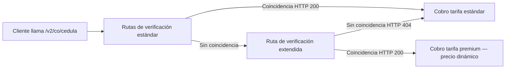

export const structuredData = {
	"@context": "https://schema.org",
	"@type": "TechArticle",
	headline: "Verificación de identidad en Colombia | API de KYC Verifik",
	description:
		"Valida la identidad de personas en Colombia con la API KYC de Verifik. Conecta con fuentes oficiales y verifica datos personales en segundos.",
	articleSection: "Documentación API",
	keywords: "verificación de identidad, API KYC, validación identidad Colombia, fuente oficial datos, prevención fraude",
	about: {
		"@type": "Thing",
		name: "API de Verificación de Identidad",
	},
};

export const faqData = {
	"@context": "https://schema.org",
	"@type": "FAQPage",
	mainEntity: [
		{
			"@type": "Question",
			name: "¿Esta API cumple con las leyes colombianas de protección de datos?",
			acceptedAnswer: {
				"@type": "Answer",
				text: "Sí, Verifik cumple con la Ley 1581 de 2012 (Habeas Data) y se adhiere a las regulaciones KYC/AML establecidas por la UIAF y la Superintendencia Financiera.",
			},
		},
		{
			"@type": "Question",
			name: "¿Qué tipos de documentos se pueden verificar?",
			acceptedAnswer: {
				"@type": "Answer",
				text: "La API soporta Cédula de Ciudadanía (CC) para ciudadanos colombianos y Permiso por Protección Temporal (PPT) para migrantes.",
			},
		},
		{
			"@type": "Question",
			name: "¿Los datos se obtienen en tiempo real?",
			acceptedAnswer: {
				"@type": "Answer",
				text: "Sí, nuestra API se conecta directamente con fuentes oficiales del gobierno para proporcionar información en tiempo real y actualizada.",
			},
		},
		{
			"@type": "Question",
			name: "¿Por qué me cobraron más que el precio listado de la cédula?",
			acceptedAnswer: {
				"@type": "Answer",
				text: "Cuando las rutas de verificación estándar en GET/POST /v2/co/cedula no devuelven coincidencia, Verifik puede intentar automáticamente una ruta de verificación extendida mediante Consulta Dinámica. Si esa ruta devuelve HTTP 200, aplica precio dinámico y se cobra el nivel premium de esa familia de endpoints. Envíe includeCost=true para ver un objeto billing en la respuesta, o revise su historial de solicitudes API.",
			},
		},
	],
};

<script type="application/ld+json" dangerouslySetInnerHTML={{ __html: JSON.stringify(structuredData) }} />
<script type="application/ld+json" dangerouslySetInnerHTML={{ __html: JSON.stringify(faqData) }} />

import Tabs from '@theme/Tabs';
import TabItem from '@theme/TabItem';

### Notas

-   Usa `documentType=CC` para cédula; `PPT` para Permiso por Protección Temporal.


---

### Verificación de identidad en Colombia

La API de Verificación de Identidad de Verifik te ayuda a autenticar ciudadanos colombianos usando datos oficiales del gobierno. Está diseñada para agilizar tus procesos de KYC (Conozca a su Cliente), prevenir fraudes y asegurar el cumplimiento normativo sin complicaciones.

Creamos esta integración para empresas que necesitan una forma rápida, segura y automatizada de confirmar la verdadera identidad de usuarios, empleados o clientes.

### ¿Qué valida esta API?

Nuestra API se conecta directamente con registros oficiales para validar:

-   **Nombre Completo y Número de ID**: Soporta *Cédula de Ciudadanía* y *Cédula de Extranjería*.
-   **Estado del Documento**: Verifica el estado actual en la base de datos de la *Registraduría Nacional del Estado Civil*.
-   **Expedición y Vigencia**: Confirma la fecha de expedición y si el documento está actualmente vigente.
-   **Coincidencia de Identidad**: Verifica que el nombre proporcionado coincida con el número de identificación.

Al verificar estos detalles, puedes tener la certeza de que la persona con la que tratas es real y posee un documento válido, reduciendo significativamente el riesgo de suplantación y fraude.

### Casos de Uso Comunes

-   **Fintech y Banca**: Verifica identidades al instante durante la apertura de cuentas o solicitudes de crédito.
-   **E-commerce y Delivery**: Autentica usuarios y repartidores antes de que se activen en tu plataforma.
-   **Recursos Humanos y Reclutamiento**: Valida documentos de candidatos como parte de tu proceso de contratación.
-   **Seguros y Salud**: Confirma identidades antes de emitir pólizas o proporcionar beneficios médicos.

### Fuentes Oficiales y Confiabilidad

Nos conectamos directamente con la *Registraduría Nacional del Estado Civil* de Colombia para asegurar que recibas información verificada y actualizada al minuto.
Cada consulta se maneja con estricto cumplimiento de estándares de seguridad y regulatorios, incluyendo:

-   **Ley 1581 de 2012** (Protección de Datos Personales)
-   **Circulares KYC/AML** de la UIAF y Superintendencia Financiera de Colombia

### Beneficios Clave

-   **Cumplimiento Automatizado**: Agiliza tus verificaciones KYC para prevenir fraudes sin agregar fricción a tus usuarios.
-   **Resultados Instantáneos**: Procesa verificaciones en segundos, perfecto para onboarding digital en tiempo real.
-   **Datos Confiables**: Confía en datos obtenidos directamente del gobierno colombiano.
-   **Integración Sencilla**: Conéctate fácilmente vía nuestra API REST o usa nuestros SDKs compatibles.

### Cumplimiento y Seguridad

Priorizamos la seguridad de tus datos. Verifik usa encriptación avanzada (HTTPS/TLS 1.3) y estándares estrictos de gestión de privacidad para garantizar la confidencialidad.
Nuestro servicio está monitoreado 24/7 para disponibilidad y ofrece controles de acceso basados en roles para mantener seguro el acceso de tu equipo.

### Sobre Verifik

Verifik es una plataforma líder en verificación de identidad, cumplimiento y prevención de fraude en América Latina.
Nuestras APIs automatizan procesos de KYC, KYB, AML y validación biométrica, conectando empresas con fuentes oficiales de datos en Colombia, México, Perú, Chile, Uruguay y más allá.

### APIs Relacionadas

Explora otros servicios de verificación en el ecosistema colombiano:

-   [**Validación Vehicular RUNT**](/verifik-es/validacion-de-vehiculo/colombia/vehiculo-por-placa-y-cedula-unicamente): Consulta historial y propiedad de vehículos.

### Preguntas Frecuentes (FAQ)

<details>
  <summary>¿Esta API cumple con las leyes colombianas de protección de datos?</summary>
  <div>
    Sí, Verifik cumple con la <strong>Ley 1581 de 2012 (Habeas Data)</strong> y se adhiere a las regulaciones KYC/AML establecidas por la UIAF y la Superintendencia Financiera. Aseguramos que todos los datos se procesen de forma segura y con la debida autorización.
  </div>
</details>

<details>
  <summary>¿Qué tipos de documentos se pueden verificar?</summary>
  <div>
    La API soporta <strong>Cédula de Ciudadanía (CC)</strong> para ciudadanos colombianos y <strong>Permiso por Protección Temporal (PPT)</strong> para migrantes venezolanos.
  </div>
</details>

<details>
  <summary>¿Los datos se obtienen en tiempo real?</summary>
  <div>
    Sí, nuestra API se conecta directamente con fuentes oficiales del gobierno para proporcionar información <strong>en tiempo real</strong> y actualizada, asegurando que siempre tengas el estado más reciente de una identidad.
  </div>
</details>

<details>
  <summary>¿Por qué me cobraron más que el precio listado de la cédula?</summary>
  <div>
    Cuando las rutas de verificación estándar en <strong>GET/POST /v2/co/cedula</strong> no devuelven coincidencia, Verifik puede intentar automáticamente una ruta de verificación extendida mediante <strong>Consulta Dinámica</strong>. Si esa ruta devuelve <strong>HTTP 200</strong>, aplica <strong>precio dinámico</strong> y se cobra el nivel premium de esa familia de endpoints. Envíe <strong>includeCost=true</strong> para ver un objeto <strong>billing</strong> en la respuesta, o revise su historial de solicitudes API.
  </div>
</details>

### Endpoint

```
https://api.verifik.co/v2/co/cedula
```

### Headers

| Name          | Value              |
| ------------- | ------------------ |
| Accept        | `application/json` |
| Authorization | `Bearer <token>`   |

### Parámetros

| Name             | Type   | Required | Description                                  |
| ---------------- | ------ | -------- | -------------------------------------------- |
| `documentType`   | string | Sí       | Uno de `CC`, `PPT`.                          |
| `documentNumber` | string | Sí       | Número de documento (sin espacios o puntos). |

### Precio dinámico {#dynamic-pricing}

Este endpoint participa en la arquitectura de **Consulta Dinámica** de Verifik. En la mayoría de los casos pagas la **tarifa estándar** de `/v2/co/cedula`. Cuando las rutas de verificación estándar no devuelven coincidencia, puede ejecutarse automáticamente una **ruta de verificación extendida**. Si esa ruta devuelve **HTTP 200**, aplica **precio dinámico** y los créditos se deducen en el **nivel premium** de esta familia de endpoints, no en el nivel estándar.

**Expectativa de precio:** Desde tu **tarifa estándar** · hasta **tarifa premium** (consulta tu plan, Postman o el panel de cliente).



**Transparencia de facturación (opcional):** envía el parámetro de consulta **`includeCost=true`**. Cuando se cobren créditos, la respuesta puede incluir un objeto **`billing`** si aplica precio dinámico:

```json
"billing": {
  "dynamicQueryApplied": true,
  "adjustmentType": "dynamic_query_premium",
  "standardCredits": 0.3,
  "chargedCredits": 2,
  "standardFeatureCode": "colombia_api_identity_lookup",
  "billedFeatureCode": "colombia_api_identity_lookup_premium"
}
```

Los montos son **ilustrativos**; los valores reales dependen de tu plan.

- **SLA:** [Precio dinámico (facturación)](/verifik-es/acuerdo-de-niveles-de-servicio#viiia-precio-dinámico-facturación)
- **Ruta premium directa:** [Cédula premium](/verifik-es/validacion-identidad/colombia/cedula-premium-cc) (`/v2/co/cedula/premium`) siempre usa tarificación premium.

### Solicitud

<Tabs>
  <TabItem value="node" label="Node.js">

```javascript
import axios from "axios";

const options = {
	method: "GET",
	url: "https://api.verifik.co/v2/co/cedula",
	params: { documentType: "CC", documentNumber: "123456789" },
	headers: {
		Accept: "application/json",
		Authorization: `Bearer ${process.env.VERIFIK_TOKEN}`,
	},
};

const { data } = await axios.request(options);
console.log(data);
```

  </TabItem>
  <TabItem value="python" label="Python">

```python
import os, requests

url = "https://api.verifik.co/v2/co/cedula"
headers = {
    "Accept": "application/json",
    "Authorization": f"Bearer {os.getenv('VERIFIK_TOKEN')}"
}
params = {
    "documentType": "CC",
    "documentNumber": "123456789"
}
r = requests.get(url, headers=headers, params=params)
print(r.json())
```

  </TabItem>
</Tabs>

### Respuesta

<Tabs>
  <TabItem value="200" label="200">

```json
{
	"data": {
		"documentType": "CC",
		"documentNumber": "123456789",
		"firstName": "Juan",
		"lastName": "Pérez",
		"fullName": "Juan Pérez",
		"status": "valid"
	},
	"signature": {
		"message": "Certified by Verifik.co",
		"dateTime": "January 16, 2024 3:44 PM"
	},
	"id": "AB123"
}
```

  </TabItem>
  <TabItem value="404" label="404">

```json
{
	"message": "Document not found",
	"code": "DOCUMENT_NOT_FOUND"
}
```

  </TabItem>
  <TabItem value="401" label="401">

```json
{
	"message": "Authentication required",
	"code": "UNAUTHORIZED"
}
```

  </TabItem>
</Tabs>


