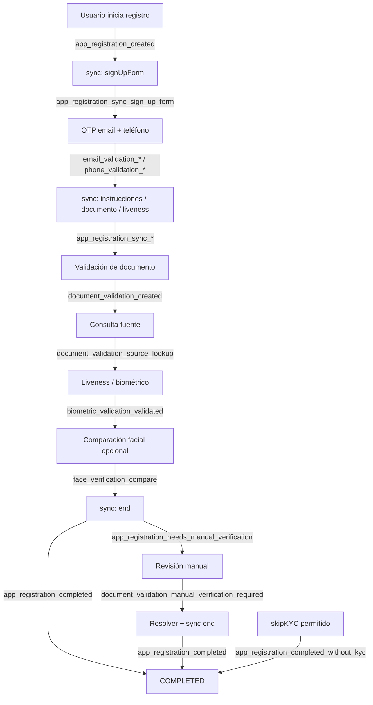

import Tabs from "@theme/Tabs";
import TabItem from "@theme/TabItem";

### Descripción general

Aquí se listan los **sufijos** de eventos que Verifik puede emitir. Tu endpoint recibe un **`type`** armado como **`${projectFlow.type}_${sufijo}`** (en Smart Enroll suele ser `onboarding`, p. ej. `onboarding_email_validation_created`).

**English:** [Supported Events](/resources/supported-events).

:::info Cuerpo HTTP

Cada envío es un **POST** HTTP a la URL del webhook del **ProjectFlow** con JSON:

```json
{
  "type": "onboarding_email_validation_created",
  "object": { }
}
```

- **`type`** — Cadena completa: **`${projectFlow.type}_${sufijo}`**. Haz match con este valor.
- **`object`** — Copia de la entidad principal. Los **OTP** se eliminan antes del envío.

Si el flujo **no** tiene webhook o la ruta no lo asocia, **no** se encola el evento.

:::

:::tip Regla rápida

Las tablas muestran solo el **`sufijo`**. En logs verás el **`type` con prefijo** (`onboarding_…`, `login_…`, etc.).

:::

### Línea de tiempo típica de onboarding

El orden real depende del proyecto (pasos opcionales, omitir KYC, gateways). El diagrama resume un **camino feliz** habitual y dónde aparecen los eventos principales. Pasos paralelos (email vs teléfono) están simplificados.



:::warning Verificación manual vs completado

Si el registro o el documento está en **`NEEDS_MANUAL_VERIFICATION`**, un **`sync`** con paso `end` puede emitir **`app_registration_needs_manual_verification`** en lugar de **`app_registration_completed`** hasta desbloquear. Más tarde puede llegar **`completed`** tras otra acción (**`sync`** o **`adminOverride`**). El orden real en red puede variar en milisegundos.

:::

---

### Tablas de referencia (orden del ciclo de vida)

#### 1. App registration (`app_registration_*`)

| Sufijo | Cuándo se emite | Entidad principal en `object` | Notas |
| --- | --- | --- | --- |
| `app_registration_created` | Nuevo registro tras insert / init | `appRegistration` | Suele incluir contexto `projectFlow` |
| `app_registration_sync_<paso>` | **`sync`** con estado **`ONGOING`** | `appRegistration` | `<paso>` en snake_case: ej. `sign_up_form`, `instructions`, `skip_kyc` |
| `app_registration_completed` | **`sync`** `end` (u otra vía staff) cuando pasa requisitos y **`COMPLETED`** | `appRegistration` | |
| `app_registration_needs_manual_verification` | **`sync`** `end` o reglas cuando hay bloqueo manual | `appRegistration` | |
| `app_registration_completed_without_kyc` | **`skipKYC`** permitido y estado **`COMPLETED_WITHOUT_KYC`** | `appRegistration` | |
| `app_registration_failed` | **`sync`** `end` con **`FAILED`** cuando la completitud lo permite | `appRegistration` | |
| `app_registration_person_already_set` | Intento de persona cuando ya existe | `appRegistration` | Incluye `error`, `statusCode`, `message` |

#### 2. Email (`email_validation_*`)

| Sufijo | Cuándo se emite | Entidad principal | Notas |
| --- | --- | --- | --- |
| `email_validation_created` | Primer envío de OTP por email | `emailValidation` | |
| `email_validation_resend` | Reenvío con envío previo aún válido | `emailValidation` | |
| `email_validation_validated` | OTP correcto (o demo válido) | `emailValidation` | |
| `email_validation_failed` | Estado pasa a failed | `emailValidation` | Patrón `email_validation_{status}` |
| `email_validation_otp_incorect` | OTP incorrecto | `emailValidation` | Ortografía **`incorect`** por compatibilidad API |
| `email_validation_expired` | Sesión expirada (~10 min) | `emailValidation` | |

#### 3. Teléfono (`phone_validation_*`)

| Sufijo | Cuándo se emite | Entidad principal | Notas |
| --- | --- | --- | --- |
| `phone_validation_created` | Primer OTP (SMS/WhatsApp) | `phoneValidation` | |
| `phone_validation_resend` | Reenvío OTP misma validación | `phoneValidation` | Puede haber cooldown; **`force`** en API |
| `phone_validation_validated` | OTP correcto | `phoneValidation` | |
| `phone_validation_failed` | Estado failed | `phoneValidation` | Patrón `phone_validation_{status}` |
| `phone_validation_otp_incorect` | OTP incorrecto | `phoneValidation` | |
| `phone_validation_expired` | Sesión expirada | `phoneValidation` | |

#### 4. Documento (`document_validation_*`)

| Sufijo | Cuándo se emite | Entidad principal | Notas |
| --- | --- | --- | --- |
| `document_validation_created` | Inicia validación de documento | `documentValidation` | Suele incluir `appRegistration`, `email`, `phone` |
| `document_validation_source_lookup` | Consulta a fuente externa / gobierno | `documentValidation` | |
| `document_validation_data_source_error` | Respuesta inválida o nombre no coincide | `documentValidation` | Puede incluir `isSupported`, `infoValidationSupportedReason`, `notSupportedData` |
| `document_validation_manual_verification_required` | Pasa a revisión manual | `documentValidation` | El registro puede quedar **`NEEDS_MANUAL_VERIFICATION`** |

#### 5. Biométrico (`biometric_validation_*` y relacionados)

| Sufijo | Cuándo se emite | Entidad principal | Notas |
| --- | --- | --- | --- |
| `biometric_validation_new` | Estado **`new`** | `biometricValidation` | Patrón `biometric_validation_{status}` |
| `biometric_validation_validated` | Estado **`validated`** | `biometricValidation` | |
| `biometric_validation_failed` | Estado **`failed`** | `biometricValidation` | |
| `biometric_validation_created_person` | Persona creada desde flujo biométrico | `biometricValidation` | |
| `biometric_validation_liveness_failed` | Liveness falla explícitamente | `biometricValidation` | |
| `biometrics_liveness_score_not_acceptable` | Score bajo el umbral del proyecto | `biometricValidation` | Puede incluir `projectFlow` |

#### 6. Rostro (`face_verification_*`)

| Sufijo | Cuándo se emite | Entidad principal | Notas |
| --- | --- | --- | --- |
| `face_verification_compare` | Comparación terminada (selfie vs documento) | `appRegistration` | Incluye **`compareResult`** |

#### 7. Información / antecedentes (`information_validation_*`)

| Sufijo | Cuándo se emite | Entidad principal | Notas |
| --- | --- | --- | --- |
| `information_validation_background_check` | Antecedentes / listas completados | `informationValidation` | |
| `information_validation_updated` | Sync desde flujo ligado a documento | `informationValidation` | Depende del contexto webhook en documento/flujo |

---

### Ejemplos de `type` completos

<Tabs>
  <TabItem value="onboarding" label="Onboarding (Smart Enroll)" default>

| Sufijo (de las tablas) | Ejemplo de `type` completo |
| --- | --- |
| `email_validation_created` | `onboarding_email_validation_created` |
| `app_registration_sync_sign_up_form` | `onboarding_app_registration_sync_sign_up_form` |
| `app_registration_completed` | `onboarding_app_registration_completed` |

  </TabItem>
  <TabItem value="login" label="Flujos login">

Si `projectFlow.type` es **`login`**, el mismo sufijo es p. ej. `login_email_validation_created`.

  </TabItem>
</Tabs>

### Páginas relacionadas

- [Webhooks de Smart Enroll (KYC)](/verifik-es/resources/smart-enroll-kyc-webhooks)
- [Integración de Webhooks](/verifik-es/resources/integracion-webhook)
- [Webhooks (descripción general)](/verifik-es/resources/webhooks)
