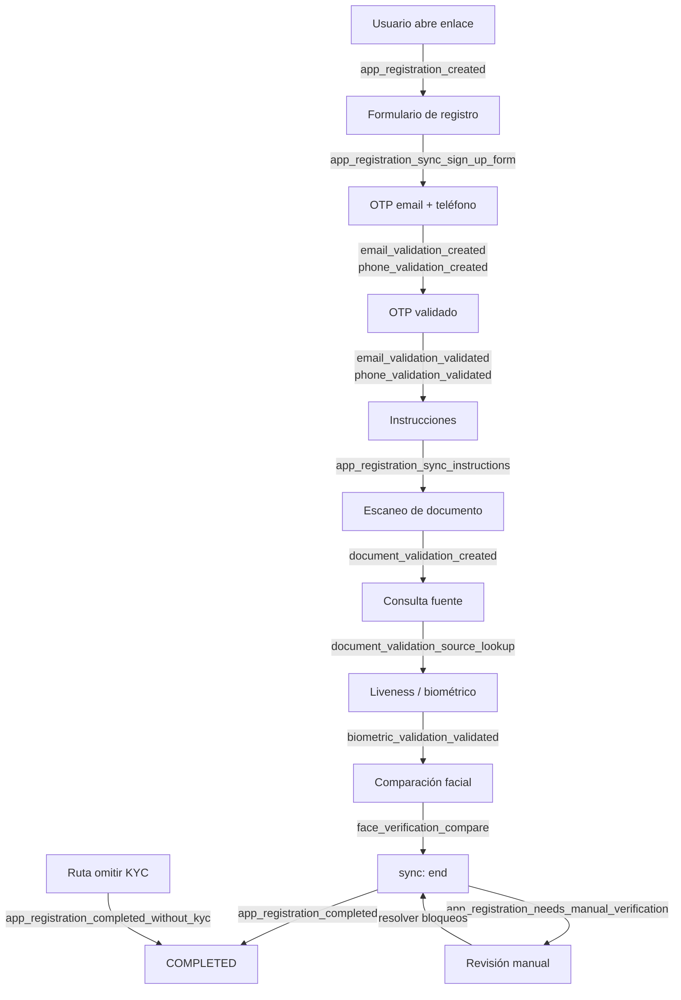

### Descripción general

Smart Enroll (onboarding) usa el **webhook** vinculado al **ProjectFlow**. Si el flujo tiene un webhook activo, Verifik encola el envío de eventos del ciclo de vida del registro, OTP por email y teléfono, documentos, biometría y módulos relacionados.

El catálogo completo está en [Eventos soportados](/verifik-es/resources/eventos-soportados). Esta página resume el **orden típico en Smart Enroll**, la **forma del payload** y el comportamiento **verificación manual vs. completado**.

**Also available:** [English version](/resources/smart-enroll-kyc-webhooks).

:::info Forma del payload

Cada envío es JSON con un **`type`** y un **`object`** de primer nivel:

```json
{
  "type": "onboarding_app_registration_completed",
  "object": { }
}
```

- **`type`** = `${projectFlow.type}_${sufijo}` — en Smart Enroll el prefijo siempre es **`onboarding`**.
- **`object`** = copia de la entidad principal (`appRegistration`, `emailValidation`, `documentValidation`, etc.). Los **OTP se eliminan** del payload.
- Los eventos `app_registration_*` generados por **sync** incluyen la referencia `webhook` cuando el flujo la tiene configurada.

Tu integración debe tolerar campos opcionales nuevos.

:::

:::tip Reglas de nombre de evento

| Patrón | Forma del sufijo | Ejemplo |
| --- | --- | --- |
| **Sync** con estado **`ONGOING`** | `app_registration_sync_<paso>` (snake_case) | `app_registration_sync_sign_up_form` |
| **Sync** cuando **cambia** el estado (`end`, `skipKYC`) | `app_registration_<estado>` | `app_registration_completed` |
| **Admin override** (auth de staff) | `app_registration_<nuevo_estado>` | `app_registration_completed` |
| **Email / Teléfono** OTP | `email_validation_<acción>` o `phone_validation_<acción>` | `email_validation_validated` |

Todos los sufijos se convierten en `type` completo con el prefijo `onboarding_`, p. ej. `onboarding_email_validation_created`. Compara siempre el **type completo** en tu código.

:::

---

### Línea de tiempo de Smart Enroll

El orden varía según el proyecto (pasos opcionales, omitir KYC, gateways). El diagrama muestra un **camino feliz** frecuente y dónde se emiten los eventos principales.



---

### Eventos del ciclo de vida en orden

La tabla lista los eventos en el **orden típico** en que se emiten durante un flujo Smart Enroll.

| # | Sufijo | Cuándo se emite | Notas |
| --- | --- | --- | --- |
| 1 | `app_registration_created` | Se crea el registro (insert) | Incluye contexto `projectFlow` |
| 2 | `app_registration_sync_sign_up_form` | Formulario enviado vía **sync** | Estado sigue `ONGOING` |
| 3 | `email_validation_created` | Primer envío de OTP por email | |
| 3a | `email_validation_resend` | Reenvío con OTP previo aún vigente | |
| 3b | `email_validation_validated` | OTP correcto | |
| 3c | `email_validation_otp_incorect` | OTP incorrecto | Ortografía coincide con API |
| 4 | `phone_validation_created` | Primer OTP (SMS / WhatsApp) | |
| 4a | `phone_validation_resend` | Reenvío misma validación | |
| 4b | `phone_validation_validated` | OTP correcto | |
| 4c | `phone_validation_otp_incorect` | OTP incorrecto | |
| 5 | `app_registration_sync_instructions` | Paso instrucciones vía **sync** | Estado sigue `ONGOING` |
| 6 | `document_validation_created` | Inicia validación de documento | Puede incluir `appRegistration`, `email`, `phone` |
| 7 | `document_validation_source_lookup` | Consulta a fuente / gobierno completa | |
| 7a | `document_validation_data_source_error` | Respuesta inválida o nombre no coincide | Puede incluir `notSupportedData` |
| 8 | `biometric_validation_validated` | Liveness aprobado | |
| 8a | `biometric_validation_liveness_failed` | Liveness falla | |
| 8b | `biometrics_liveness_score_not_acceptable` | Score bajo el umbral del proyecto | |
| 9 | `face_verification_compare` | Comparación facial (selfie vs documento) | Incluye `compareResult` |
| 10 | `document_validation_manual_verification_required` | Documento pasa a revisión manual | Bloquea `COMPLETED` |
| 11 | **`app_registration_completed`** | **sync** `end` — requisitos cumplidos | Evento final exitoso |
| 11 | **`app_registration_needs_manual_verification`** | **sync** `end` — quedan bloqueos | Ver advertencia abajo |
| 11 | **`app_registration_completed_without_kyc`** | Ruta **skipKYC**, flujo lo permite | |
| 11 | **`app_registration_failed`** | **sync** `end` — completitud = `FAILED` | |

---

### Verificación manual vs. `COMPLETED`

:::warning Comportamiento clave

- **`NEEDS_MANUAL_VERIFICATION`** significa que el registro está **bloqueado** y no puede completarse hasta que ops resuelva las revisiones pendientes (p. ej. verificación manual de documento).
- No asumas que cada **`sync` `end`** con `status: "COMPLETED"` en la petición producirá `app_registration_completed`. El servidor fija el estado según **completitud y reglas del flujo** y puede emitir `app_registration_needs_manual_verification` en su lugar.
- Tras resolver los bloqueos, un **sync** o **adminOverride** posterior puede llevar el registro a `COMPLETED` y emitir `app_registration_completed`.
- El orden real en red puede variar en milisegundos — diseña para idempotencia.

:::

---

### Recursos relacionados

- [Eventos soportados](/verifik-es/resources/eventos-soportados) — catálogo completo con tablas de referencia
- [Integración de Webhooks](/verifik-es/resources/integracion-webhook) — servidor receptor de ejemplo
- [Webhooks (descripción general)](/verifik-es/resources/webhooks)
- [Supported Events (EN)](/resources/supported-events)
