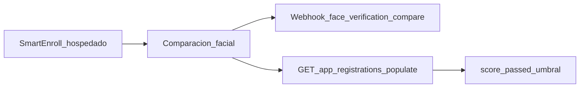

# SmartEnroll — Guía de API

Tras completar el KYC de **SmartEnroll hospedado**, usa esta guía para integrar resultados en tu backend: scores de comparación facial, vitalidad, webhooks y los endpoints relevantes. Es un complemento a la documentación de producto—no sustituye la [API de SmartEnroll autoalojado](/verifik-es/smart-enroll-auto-alojado).

## Resumen del flujo



1. El usuario final completa documento + biometría en el flujo hospedado.
2. Verifik ejecuta la comparación facial (selfie vs cara del documento) con los umbrales de tu proyecto.
3. Recibes un webhook (si está configurado) y/o consultas el app registration con populates.
4. Aplicas tus reglas de negocio con `score`, `passed` y `compare_min_score`.

## Leer scores de comparación facial

**No existe** un `GET /v2/face-verifications/:id` público. Los scores viven en el `FaceVerification` enlazado desde el app registration.

```
GET https://api.verifik.co/v2/app-registrations/{id}?populates[]=compareFaceVerification
```

Campos útiles en el objeto populado:

| Campo | Significado |
| --- | --- |
| `compareFaceVerification.result.score` | Score de similitud (0–1) |
| `compareFaceVerification.result.passed` | Si el score cumplió el umbral efectivo |
| `compareFaceVerification.result.compare_min_score` | Umbral usado en esa comparación |
| `compareFaceVerification.comparedAt` | Cuándo se ejecutó la comparación |

**TTL:** Los registros FaceVerification expiran en unos **90 días** en producción (**10 días** en desarrollo). Tras expirar, `compareFaceVerification` puede venir vacío aunque el app registration siga existiendo.

Consulta también la documentación de app registrations en Resources (Get App Registration).

### Populates útiles

Conjunto habitual para un snapshot completo del enrollment:

`project`, `projectFlow`, `emailValidation`, `phoneValidation`, `biometricValidation`, `documentValidation`, `person`, `face`, `documentFace`, `compareFaceVerification`, `informationValidation`

## Endpoints clave

| Endpoint | Propósito |
| --- | --- |
| [`POST /v2/face-recognition/liveness`](/verifik-es/deteccion-vitalidad) | Detección de vitalidad estándar |
| [`POST /v2/face-recognition/liveness-score`](/verifik-es/puntaje-vitalidad) | Vitalidad enfocada en el puntaje (misma facturación que `/liveness`) |
| [`POST /v2/face-recognition/compare`](/verifik-es/comparar) | Comparación facial 1:1 (API directa) |
| [`POST /v2/face-recognition/compare-with-liveness`](/verifik-es/comparar-con-deteccion-vitalidad) | Comparar y luego vitalidad (secuencial) |
| `POST /v2/face-recognition/compare/app-registration` | Comparación del flujo hospedado: usa `appRegistrationId` de la sesión; gallery/probe desde caras guardadas; cuerpo vacío `{}` válido; umbral del project flow |
| `GET /v2/app-registrations/:id` | Leer el enrollment + popular scores |
| `POST /v2/biometric-validations/app-registration` | Paso biométrico / vitalidad en la sesión hospedada |
| `POST /v2/document-validations/app-registration` | Captura / validación de documento en la sesión hospedada |
| `POST /v2/identity-images/appRegistration` | Guardar imágenes de identidad (`face`, `documentFace`, …) |

Para una UI totalmente personalizada, empieza por [SmartEnroll autoalojado](/verifik-es/smart-enroll-auto-alojado).

## Umbrales de comparación facial

| Contexto | Valores |
| --- | --- |
| SmartEnroll hospedado / project flow (por defecto) | **`0.85`** (`compareMinScore`) |
| API directa de face-recognition (`compare_min_score`) | **`0.67`–`0.95`** (por defecto `0.85` si se omite) |

Las fotos de documentos impresos (por ejemplo una CC colombiana) suelen coincidir con un selfie en vivo a scores **más bajos** que en vivo vs en vivo. Si usuarios genuinos fallan alrededor de 0.7, considera bajar el umbral del proyecto tras validar el riesgo de falsos aceptados.

## `cropFace`

`cropFace` en servidor **no está soportado** en los endpoints de face-recognition compare. Omite el campo (se ignora si se envía). Envía imágenes enfocadas en el rostro o recorta en el cliente antes de llamar a la API.

## Webhooks

Cuando el project flow tiene webhook, la comparación facial emite un evento con sufijo `face_verification_compare`. El `type` entregado es:

```
{projectFlow.type}_face_verification_compare
```

Ejemplo: `onboarding_face_verification_compare`.

El payload incluye campos del app registration más `compareResult` (resultado FaceVerification). Inventario completo: [Webhooks KYC de Smart Enroll](/verifik-es/resources/smart-enroll-kyc-webhooks).

## Vitalidad / PAD (resumen de producto)

La vitalidad facial de Verifik usa nuestro stack biométrico con detección de ataques de presentación (PAD). La vitalidad está **certificada iBeta Level 2** y alineada con **ISO 30107 Level 1 y Level 2**. Está diseñada para detectar vectores de spoofing comunes como **fotos impresas, reproducción de video y máscaras 3D**, mediante una verificación de una sola imagen. Detalles: [Detección de vitalidad](/verifik-es/deteccion-vitalidad) y [Puntaje de vitalidad](/verifik-es/puntaje-vitalidad).

## Documentación de producto relacionada

- [SmartEnroll](/verifik-es/smartenroll) — configuración del proyecto
- [Flujo KYC SmartEnroll](/verifik-es/smartenroll/smartenroll-flujo-kyc) — experiencia del usuario final
- [Revisión KYC admin](/verifik-es/smartenroll/smartenroll-admin-revision-kyc) — UI de revisión e interpretación de scores
- [SmartEnroll autoalojado](/verifik-es/smart-enroll-auto-alojado) — APIs programáticas de proyecto/flujo

## Receta rápida

1. Completa (o espera) el enrollment hospedado.
2. Escucha `{type}_face_verification_compare` **o** llama `GET /v2/app-registrations/{id}?populates[]=compareFaceVerification`.
3. Lee `result.score`, `result.passed` y `result.compare_min_score`.
4. Aplica tus reglas de aprobar / revisar / rechazar (recuerda el TTL de FaceVerification).
