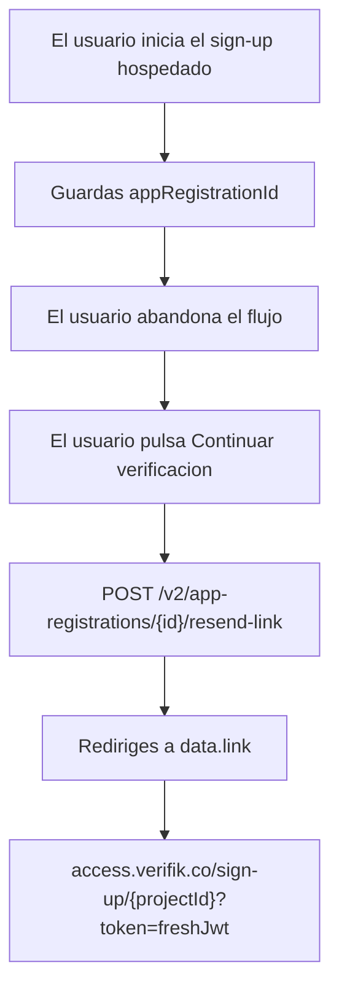

# Reanudar un enrollment incompleto

Cuando un usuario inicia **SmartEnroll hospedado** y se va antes de terminar, **no** lo envíes de nuevo al formulario de alta con el mismo correo o teléfono. Eso intenta crear otro registro y responde `409:email_is_registered_already` ("Email is already registered").

Guarda el `_id` del App Registration de la primera sesión. Cuando el usuario pulse **Continuar verificación**, genera una URL hospedada nueva con [Reenviar enlace de registro de aplicación](/verifik-es/resources/registros-aplicacion/reenviar-enlace-registro-aplicacion) y redirígelo a `data.link`.

## Flujo del integrador



1. El usuario abre `https://access.verifik.co/sign-up/{projectId}` (o creas el registro con `POST /v2/app-registrations`).
2. Persiste `appRegistrationId` (y, si quieres, el primer token) en tu aplicación.
3. Si el usuario vuelve más tarde, llama `POST /v2/app-registrations/{id}/resend-link` con el **token de API del cliente**.
4. Redirige el navegador a `data.link`. La app hospedada carga el registro existente y continúa desde el paso actual (correo, teléfono, documento, vitalidad, etc.).

La acción **Reenviar enlace** del admin de Verifik (copiar enlace o enviar correo) usa el mismo endpoint.

## URL hospedada y tokens

Reanudar y el primer inicio usan la **misma ruta**:

```
https://access.verifik.co/sign-up/{projectId}?token={jwt}
```

Cambia el token, no la ruta.

| Token | Vigencia | Uso |
| --- | --- | --- |
| Token de creación de `POST /v2/app-registrations` | **120 minutos** | Solo la primera sesión. Puedes reutilizar la URL original mientras el JWT siga vigente. |
| Token de continuación de `POST .../resend-link` | **30 minutos** | Forma recomendada de reanudar. Genera uno nuevo cada vez que el usuario vuelva. |

Cuando el token de creación caduca, la app hospedada quita `?token=` y vuelve a mostrar el formulario de alta. Enviar ese formulario con el mismo correo o teléfono es lo que provoca **already registered**.

`GET /v2/app-registrations/{id}` y `PUT /v2/app-registrations/{id}/sync` **no** devuelven una URL de continuación hospedada. Sync avanza pasos **dentro** de una sesión activa; no es la forma de devolver al usuario al flujo hospedado.

## Qué no usar

| Mecanismo | Rol |
| --- | --- |
| `POST /v2/app-registrations` otra vez con el mismo email/teléfono | Conflicto (`email_is_registered_already` / `phone_is_registered_already`) |
| `smartLink` en el objeto App Registration | Producto OneTimeLink en `link.verifik.co`, no el resume de SmartEnroll hospedado |
| `PUT /{id}/sync` | Actualiza paso/estado dentro de la sesión |
| `POST /{id}/regenerate-token` | Solo staff / super-admin |
| `POST /resume-kyc` | Reinicio de KYC de facturación del cliente Verifik (borra documento y vitalidad). No es la API de resume para integradores |

## Estados que puedes reanudar

`resend-link` funciona en registros incompletos como `STARTED` y `ONGOING`. Los tokens de cliente no pueden reenviar para `COMPLETED`, `COMPLETED_WITHOUT_KYC` o `FAILED`.

## Relacionado

- [Reenviar enlace de registro de aplicación](/verifik-es/resources/registros-aplicacion/reenviar-enlace-registro-aplicacion) — contrato de request y response
- [Crear un Registro de Aplicación](/verifik-es/resources/registros-aplicacion/crear-un-registro-aplicacion) — primera sesión y vigencia del token de creación
- [Flujo KYC SmartEnroll](/verifik-es/smartenroll/smartenroll-flujo-kyc) — pasos del usuario final
- [SmartEnroll — Guía de API](/verifik-es/smartenroll/guia-api) — scores y webhooks tras el KYC
