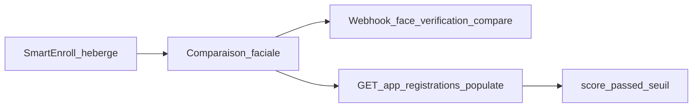

# SmartEnroll — Guide API

Après qu’un utilisateur a terminé le KYC **SmartEnroll hébergé**, utilisez ce guide pour intégrer les résultats dans votre backend : scores de comparaison faciale, liveness, webhooks et endpoints utiles. Ce n’est pas une réécriture complète de l’[API SmartEnroll self-hosted](https://docs.verifik.co/smart-enroll-self-hosted).

## Vue d’ensemble du flux



1. L’utilisateur final termine document + biométrie dans le flux hébergé.
2. Verifik exécute la comparaison faciale (selfie vs visage du document) avec les seuils de votre projet.
3. Vous recevez un webhook (si configuré) et/ou interrogez l’app registration avec des populates.
4. Vous appliquez vos règles métier avec `score`, `passed` et `compare_min_score`.

## Lire les scores de comparaison faciale

Il n’existe **pas** de `GET /v2/face-verifications/:id` public. Les scores sont sur le `FaceVerification` lié à l’app registration.

```
GET https://api.verifik.co/v2/app-registrations/{id}?populates[]=compareFaceVerification
```

Champs utiles sur l’objet peuplé :

| Champ | Signification |
| --- | --- |
| `compareFaceVerification.result.score` | Score de similarité (0–1) |
| `compareFaceVerification.result.passed` | Si le score a atteint le seuil effectif |
| `compareFaceVerification.result.compare_min_score` | Seuil utilisé pour cette comparaison |
| `compareFaceVerification.comparedAt` | Moment de la comparaison |

**TTL :** les enregistrements FaceVerification expirent après environ **90 jours** en production (**10 jours** en développement). Après expiration, `compareFaceVerification` peut être vide même si l’app registration existe encore.

Voir aussi : [Get App Registration](https://docs.verifik.co/resources/app-registrations/retrieve-an-app-registration).

### Populates utiles

Jeu courant pour un snapshot complet :

`project`, `projectFlow`, `emailValidation`, `phoneValidation`, `biometricValidation`, `documentValidation`, `person`, `face`, `documentFace`, `compareFaceVerification`, `informationValidation`

## Endpoints clés

| Endpoint | Objectif |
| --- | --- |
| [`POST /v2/face-recognition/liveness`](https://docs.verifik.co/biometrics/liveness) | Détection de liveness standard |
| [`POST /v2/face-recognition/liveness-score`](https://docs.verifik.co/biometrics/liveness-score) | Liveness axé sur le score (même facturation que `/liveness`) |
| [`POST /v2/face-recognition/compare`](https://docs.verifik.co/biometrics/compare) | Comparaison 1:1 (API directe) |
| [`POST /v2/face-recognition/compare-with-liveness`](https://docs.verifik.co/biometrics/compare-with-liveness) | Comparer puis liveness (séquentiel) |
| `POST /v2/face-recognition/compare/app-registration` | Comparaison du parcours hébergé : JWT avec `appRegistrationId` ; gallery/probe depuis les visages stockés ; corps `{}` valide ; seuil du project flow |
| [`GET /v2/app-registrations/:id`](https://docs.verifik.co/resources/app-registrations/retrieve-an-app-registration) | Lire l’enrollment + peupler les scores |
| `POST /v2/biometric-validations/app-registration` | Étape biométrique / liveness en session hébergée |
| `POST /v2/document-validations/app-registration` | Capture / validation document en session hébergée |
| `POST /v2/identity-images/appRegistration` | Stocker les images d’identité (`face`, `documentFace`, …) |

Pour une UI entièrement personnalisée : [SmartEnroll Self Hosted](https://docs.verifik.co/smart-enroll-self-hosted).

## Seuils de comparaison faciale

| Contexte | Valeurs |
| --- | --- |
| SmartEnroll hébergé / project flow (défaut) | **`0.85`** (`compareMinScore`) |
| API face-recognition (`compare_min_score`) | **`0.67`–`0.95`** (défaut `0.85` si omis) |

Les photos de documents imprimés correspondent souvent à un selfie live avec des scores **plus bas** qu’un live vs live. Si des utilisateurs légitimes échouent autour de 0,7, envisagez d’abaisser le seuil du projet après validation du risque de faux acceptés.

## `cropFace`

`cropFace` côté serveur **n’est pas pris en charge** sur les endpoints face-recognition compare. Omettez le champ (ignoré s’il est envoyé). Envoyez des images centrées sur le visage, ou recadrez côté client.

## Webhooks

Si le project flow a un webhook, la comparaison faciale émet un événement avec le suffixe `face_verification_compare`. Le `type` livré est :

```
{projectFlow.type}_face_verification_compare
```

Exemple : `onboarding_face_verification_compare`.

Le payload inclut les champs de l’app registration plus `compareResult`. Inventaire complet : [Smart Enroll KYC Webhooks](https://docs.verifik.co/resources/smart-enroll-kyc-webhooks).

## Liveness / PAD (résumé produit)

La liveness faciale Verifik utilise notre stack biométrique avec détection d’attaques de présentation (PAD). La liveness est **certifiée iBeta Level 2** et alignée sur **ISO 30107 Level 1 et Level 2**. Elle vise les vecteurs courants : **photos imprimées, replay vidéo et masques 3D**, via une vérification sur une seule image. Détails : [Liveness](https://docs.verifik.co/biometrics/liveness) et [Liveness Score](https://docs.verifik.co/biometrics/liveness-score).

## Documentation produit associée

- [SmartEnroll](https://docs.verifik.co/smartenroll) — configuration du projet
- [SmartEnroll KYC Flow](https://docs.verifik.co/smartenroll/smartenroll-kyc-flow) — expérience utilisateur
- [SmartEnroll Admin KYC Review](https://docs.verifik.co/smartenroll/smartenroll-admin-kyc-review) — UI de revue et interprétation des scores
- [SmartEnroll Self Hosted](https://docs.verifik.co/smart-enroll-self-hosted) — APIs projet/flux

## Recette rapide

1. Terminez (ou attendez) l’enrollment hébergé.
2. Écoutez `{type}_face_verification_compare` **ou** appelez `GET /v2/app-registrations/{id}?populates[]=compareFaceVerification`.
3. Lisez `result.score`, `result.passed` et `result.compare_min_score`.
4. Appliquez vos règles d’approbation / revue / rejet (pensez au TTL FaceVerification).
