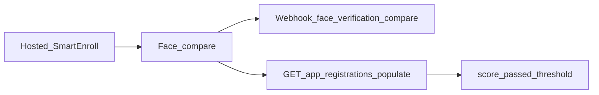

# SmartEnroll API コンパニオン

ユーザーが**ホスト型 SmartEnroll** KYC を完了したあと、バックエンドへ結果を取り込むためのガイドです。顔照合スコア、ライブネス、Webhook、重要なエンドポイントを扱います。製品ドキュメントの補助であり、[セルフホスト SmartEnroll API](https://docs.verifik.co/smart-enroll-self-hosted) の置き換えではありません。

## フロー概要



1. エンドユーザーがホスト型フローで書類＋生体ステップを完了します。
2. Verifik がプロジェクトのしきい値で顔照合（セルフィー vs 書類の顔）を実行します。
3. Webhook（設定時）を受け取るか、populates 付きで app registration を取得します。
4. `score`、`passed`、`compare_min_score` でビジネスルールを適用します。

## 顔照合スコアの読み方

公開の `GET /v2/face-verifications/:id` は**ありません**。スコアは app registration に紐づく `FaceVerification` にあります。

```
GET https://api.verifik.co/v2/app-registrations/{id}?populates[]=compareFaceVerification
```

populate 後の主なフィールド:

| フィールド | 意味 |
| --- | --- |
| `compareFaceVerification.result.score` | 類似度スコア（0–1） |
| `compareFaceVerification.result.passed` | 有効なしきい値を満たしたか |
| `compareFaceVerification.result.compare_min_score` | その照合で使われたしきい値 |
| `compareFaceVerification.comparedAt` | 照合実行時刻 |

**TTL:** FaceVerification は本番で約 **90 日**（開発 **10 日**）で期限切れになります。期限後は app registration が残っていても `compareFaceVerification` が空になることがあります。

参照: [Get App Registration](https://docs.verifik.co/resources/app-registrations/retrieve-an-app-registration)。

### 便利な populates

エンロール全体のスナップショットによく使うセット:

`project`, `projectFlow`, `emailValidation`, `phoneValidation`, `biometricValidation`, `documentValidation`, `person`, `face`, `documentFace`, `compareFaceVerification`, `informationValidation`

## 主要エンドポイント

| エンドポイント | 用途 |
| --- | --- |
| [`POST /v2/face-recognition/liveness`](https://docs.verifik.co/biometrics/liveness) | 標準ライブネス検出 |
| [`POST /v2/face-recognition/liveness-score`](https://docs.verifik.co/biometrics/liveness-score) | スコア中心のライブネス（課金は `/liveness` と同じ） |
| [`POST /v2/face-recognition/compare`](https://docs.verifik.co/biometrics/compare) | 1:1 顔照合（直接 API） |
| [`POST /v2/face-recognition/compare-with-liveness`](https://docs.verifik.co/biometrics/compare-with-liveness) | 照合のあとライブネス（順次） |
| `POST /v2/face-recognition/compare/app-registration` | ホスト経路の照合: セッションの `appRegistrationId`、保存済み顔を gallery/probe に使用、空 body `{}` 可、しきい値は project flow |
| [`GET /v2/app-registrations/:id`](https://docs.verifik.co/resources/app-registrations/retrieve-an-app-registration) | エンロール取得＋スコアの populate |
| `POST /v2/biometric-validations/app-registration` | ホストセッションの生体／ライブネス手順 |
| `POST /v2/document-validations/app-registration` | ホストセッションの書類キャプチャ／検証 |
| `POST /v2/identity-images/appRegistration` | 本人確認画像の保存（`face`、`documentFace` など） |

完全カスタム UI は [SmartEnroll Self Hosted](https://docs.verifik.co/smart-enroll-self-hosted) から。

## 顔照合のしきい値

| コンテキスト | 値 |
| --- | --- |
| ホスト型 SmartEnroll / project flow の既定 | **`0.85`**（`compareMinScore`） |
| 直接 face-recognition API（`compare_min_score`） | **`0.67`–`0.95`**（省略時は `0.85`） |

印刷された書類写真（例: コロンビアの CC）は、ライブ同士より**低い**スコアになりがちです。正当なユーザーが 0.7 台で失敗する場合は、誤受理リスクを検証したうえでプロジェクトしきい値の引き下げを検討してください。

## `cropFace`

face-recognition compare エンドポイントではサーバー側 `cropFace` は**非対応**です。フィールドは省略してください（送っても無視されます）。顔中心の画像を送るか、クライアント側で切り抜いてから呼び出してください。

## Webhooks

project flow に Webhook がある場合、顔照合は接尾辞 `face_verification_compare` のイベントを送信します。配信される `type` は次のとおりです。

```
{projectFlow.type}_face_verification_compare
```

例: `onboarding_face_verification_compare`。

ペイロードには app registration のフィールドと `compareResult` が含まれます。一覧: [Smart Enroll KYC Webhooks](https://docs.verifik.co/resources/smart-enroll-kyc-webhooks)。

## ライブネス / PAD（製品要約）

Verifik の顔ライブネスは、プレゼンテーション攻撃検知（PAD）付きの生体スタックを使用します。ライブネスは **iBeta Level 2 認定**で、**ISO 30107 Level 1 / Level 2** に整合します。**印刷写真、動画リプレイ、3D マスク**などの一般的ななりすましを、単一画像チェックで検知するよう設計されています。詳細: [Liveness](https://docs.verifik.co/biometrics/liveness)、[Liveness Score](https://docs.verifik.co/biometrics/liveness-score)。

## 関連する製品ドキュメント

- [SmartEnroll](https://docs.verifik.co/smartenroll) — プロジェクト設定
- [SmartEnroll KYC Flow](https://docs.verifik.co/smartenroll/smartenroll-kyc-flow) — エンドユーザー体験
- [SmartEnroll Admin KYC Review](https://docs.verifik.co/smartenroll/smartenroll-admin-kyc-review) — 審査 UI とスコア解釈
- [SmartEnroll Self Hosted](https://docs.verifik.co/smart-enroll-self-hosted) — プロジェクト／フロー API

## クイックレシピ

1. ホスト型エンロールの完了を待つ（または完了させる）。
2. `{type}_face_verification_compare` を受信するか、`GET /v2/app-registrations/{id}?populates[]=compareFaceVerification` を呼ぶ。
3. `result.score`、`result.passed`、`result.compare_min_score` を読む。
4. 承認／レビュー／却下ルールを適用する（FaceVerification の TTL に注意）。
