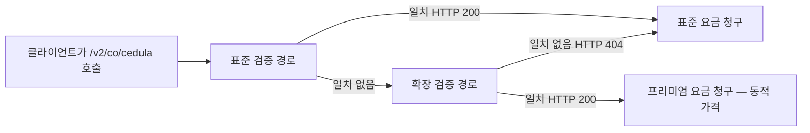

export const structuredData = {
	"@context": "https://schema.org",
	"@type": "TechArticle",
	headline: "콜롬비아 국민 신분증 확인 | Verifik KYC API",
	description:
		"콜롬비아 국민 신분증(CC) 또는 PPT로 신원을 확인합니다. GET /v2/co/cedula.",
	articleSection: "API 문서",
	keywords: "콜롬비아, cédula, CC, PPT, KYC, Verifik",
	about: {
		"@type": "Thing",
		name: "신원 확인 API",
	},
};

<script type="application/ld+json" dangerouslySetInnerHTML={{ __html: JSON.stringify(structuredData) }} />

import Tabs from "@theme/Tabs";
import TabItem from "@theme/TabItem";

### 엔드포인트

```
GET https://api.verifik.co/v2/co/cedula
```

동일 경로: `GET https://verifik.app/v2/co/cedula`

같은 필드로 **`POST`**도 지원합니다(본문에 `documentType`, `documentNumber`).

### 헤더

| 이름 | 값 |
| --- | --- |
| Accept | `application/json` |
| Authorization | `Bearer <token>` |

### 서류 요건

**대상:** *Cédula de Ciudadanía* (**CC**)를 가진 **콜롬비아 국민**, 또는 민사 등록 출처에서 **이름·신원 데이터**가 필요한 *Permiso de Protección Temporal* (**PPT**) **베네수엘라 이주민**.

| 유형 | 보유자 | `documentType` | 콜롬비아 일반 길이 | 이 API 허용 |
| --- | --- | --- | --- | --- |
| **CC** | 콜롬비아 국민 | `CC` | **3–10**자리 (흔함: **8** 또는 **10** NUIP) | **5–10**자리, 숫자만 |
| **PPT** | 베네수엘라 이주민 (이 경로 이름 조회) | `PPT` | 최대 **7**자리 | **5–10**자리, 숫자만 |

**`documentNumber` 입력:** 숫자만 — 점, 공백, 하이픈 없음. CC 예: `1032386359`.

**다른 엔드포인트 사용:**
- **CE** (*Cédula de Extranjería*) → [콜롬비아 CE](/verifik-ko/identity/colombia-ce) (`/v2/co/foreigner-id/ce` + `expeditionDate`)
- **PPT 이민 상태** (VIGENTE / 만료) → [콜롬비아 PPT](/verifik-ko/identity/colombia-ppt) (`/v2/co/foreigner-id/ppt` + `expeditionDate`)
- **이민 PEP** (*Permiso Especial de Permanencia*, 15자리) → [콜롬비아 PEP](/verifik-ko/identity/colombia-pep-id)

전체 비교: [신분증 유형 가이드](/verifik-ko/identity-validation/colombia/colombia-identity-documents-guide).

### 매개변수

| 이름 | 형식 | 필수 | 설명 |
| --- | --- | --- | --- |
| `documentType` | string | 예 | **`CC`** (*Cédula de Ciudadanía*) 또는 **`PPT`** (*Permiso de Protección Temporal*). **`NIT`**, **`CE`**, 이민 **`PEP`**는 **허용되지 않음** — [신분증 가이드](/verifik-ko/identity-validation/colombia/colombia-identity-documents-guide) 참고. |
| `documentNumber` | string | 예 | 문서 번호, **숫자만**(공백·마침표 없음). **5–10**자(API 검증). CC는 보통 **8** 또는 **10**자리; PPT는 공식 기록에서 **최대 7**자리. 예: `1032386359`. |

### 동적 가격 {#dynamic-pricing}

이 엔드포인트는 Verifik **동적 쿼리** 아키텍처에 포함됩니다. 대부분의 경우 `/v2/co/cedula`의 **표준 요금**이 청구됩니다. 표준 검증 경로가 일치를 반환하지 않으면 **확장 검증 경로**가 자동으로 실행될 수 있습니다. 해당 경로가 **HTTP 200**을 반환하면 **동적 가격**이 적용되며, 크레딧은 표준 등급이 아닌 이 엔드포인트 패밀리의 **프리미엄 등급**으로 차감됩니다.

**가격 예상:** 계정 **표준 요금**부터 **프리미엄 요금**까지(플랜, Postman 또는 클라이언트 패널 참조).



**선택적 청구 투명성:** 쿼리 매개변수 **`includeCost=true`**를 전달하세요. 크레딧이 청구될 때 동적 가격이 적용되면 응답에 **`billing`** 객체가 포함될 수 있습니다:

```json
"billing": {
  "dynamicQueryApplied": true,
  "adjustmentType": "dynamic_query_premium",
  "standardCredits": 0.3,
  "chargedCredits": 2,
  "standardFeatureCode": "colombia_api_identity_lookup",
  "billedFeatureCode": "colombia_api_identity_lookup_premium"
}
```

크레딧 금액은 **예시**이며, 실제 값은 플랜에 따라 다릅니다.

- **SLA:** [동적 가격(청구)](/verifik-ko/legal/service-level-agreement#viiia-동적-가격-청구)
- **직접 프리미엄 경로:** [프리미엄 신분증](/verifik-ko/identity-validation/colombia/colombian-cedula-premium)(`/v2/co/cedula/premium`)은 항상 프리미엄 요금이 적용됩니다.

### 참고

- 탐색기(UI)에 **`NIT`**가 함께 표시되는 경우가 있으나, **`/v2/co/cedula`**의 검증 스키마는 **`CC`**, **`PPT`**만 허용합니다.
- 응답 예시·FAQ는 영문 [Colombian Citizen](https://docs.verifik.co/identity-validation/colombia/colombian-citizen)를 참고하세요.

### 요청

<Tabs>
  <TabItem value="javascript" label="JavaScript">

```javascript
import axios from "axios";

const { data } = await axios.get("https://api.verifik.co/v2/co/cedula", {
	params: { documentType: "CC", documentNumber: "123456789" },
	headers: {
		Accept: "application/json",
		Authorization: `Bearer ${process.env.VERIFIK_TOKEN}`,
	},
});
console.log(data);
```

  </TabItem>
  <TabItem value="python" label="Python">

```python
import os, requests

url = "https://api.verifik.co/v2/co/cedula"
headers = {"Accept": "application/json", "Authorization": f"Bearer {os.getenv('VERIFIK_TOKEN')}"}
params = {"documentType": "CC", "documentNumber": "123456789"}
r = requests.get(url, headers=headers, params=params)
print(r.json())
```

  </TabItem>
</Tabs>
