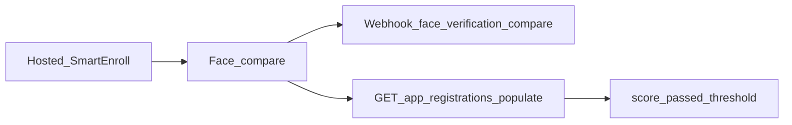

# SmartEnroll API 가이드

사용자가 **호스팅 SmartEnroll** KYC를 완료한 뒤, 백엔드로 결과를 가져오는 방법을 정리한 가이드입니다. 얼굴 매칭 점수, 라이브니스, 웹훅, 핵심 엔드포인트를 다룹니다. 제품 문서의 보조 자료이며 [셀프호스팅 SmartEnroll API](https://docs.verifik.co/smart-enroll-self-hosted)를 대체하지 않습니다.

## 흐름 개요



1. 최종 사용자가 호스팅 플로우에서 문서 + 생체 단계를 완료합니다.
2. Verifik가 프로젝트 임계값으로 얼굴 비교(셀피 vs 문서 얼굴)를 실행합니다.
3. 웹훅을 받거나(설정된 경우) populates로 app registration을 조회합니다.
4. `score`, `passed`, `compare_min_score`로 비즈니스 규칙을 적용합니다.

## 얼굴 비교 점수 읽기

공개 `GET /v2/face-verifications/:id`는 **없습니다**. 점수는 app registration에 연결된 `FaceVerification`에 있습니다.

```
GET https://api.verifik.co/v2/app-registrations/{id}?populates[]=compareFaceVerification
```

populate된 객체의 주요 필드:

| 필드 | 의미 |
| --- | --- |
| `compareFaceVerification.result.score` | 유사도 점수 (0–1) |
| `compareFaceVerification.result.passed` | 유효 임계값 충족 여부 |
| `compareFaceVerification.result.compare_min_score` | 해당 비교에 사용된 임계값 |
| `compareFaceVerification.comparedAt` | 비교 실행 시각 |

**TTL:** FaceVerification 기록은 프로덕션에서 약 **90일**(개발 **10일**) 후 만료됩니다. 만료 후에는 app registration이 남아 있어도 `compareFaceVerification`이 비어 있을 수 있습니다.

참고: [Get App Registration](https://docs.verifik.co/resources/app-registrations/retrieve-an-app-registration).

### 유용한 populates

전체 enrollment 스냅샷에 자주 쓰는 세트:

`project`, `projectFlow`, `emailValidation`, `phoneValidation`, `biometricValidation`, `documentValidation`, `person`, `face`, `documentFace`, `compareFaceVerification`, `informationValidation`

## 주요 엔드포인트

| 엔드포인트 | 용도 |
| --- | --- |
| [`POST /v2/face-recognition/liveness`](https://docs.verifik.co/biometrics/liveness) | 표준 라이브니스 감지 |
| [`POST /v2/face-recognition/liveness-score`](https://docs.verifik.co/biometrics/liveness-score) | 점수 중심 라이브니스 (`/liveness`와 동일 과금) |
| [`POST /v2/face-recognition/compare`](https://docs.verifik.co/biometrics/compare) | 1:1 얼굴 비교 (직접 API) |
| [`POST /v2/face-recognition/compare-with-liveness`](https://docs.verifik.co/biometrics/compare-with-liveness) | 비교 후 라이브니스 (순차) |
| `POST /v2/face-recognition/compare/app-registration` | 호스팅 경로 비교: 세션 `appRegistrationId` 사용; gallery/probe는 저장된 얼굴; 빈 body `{}` 가능; 임계값은 project flow |
| [`GET /v2/app-registrations/:id`](https://docs.verifik.co/resources/app-registrations/retrieve-an-app-registration) | enrollment 조회 + 점수 populate |
| `POST /v2/biometric-validations/app-registration` | 호스팅 세션의 생체/라이브니스 단계 |
| `POST /v2/document-validations/app-registration` | 호스팅 세션의 문서 캡처/검증 |
| `POST /v2/identity-images/appRegistration` | 신원 이미지 저장 (`face`, `documentFace` 등) |

완전 커스텀 UI는 [SmartEnroll Self Hosted](https://docs.verifik.co/smart-enroll-self-hosted)부터 시작하세요.

## 얼굴 매칭 임계값

| 컨텍스트 | 값 |
| --- | --- |
| 호스팅 SmartEnroll / project flow 기본값 | **`0.85`** (`compareMinScore`) |
| 직접 face-recognition API (`compare_min_score`) | **`0.67`–`0.95`** (생략 시 기본 `0.85`) |

인쇄된 서류 사진(예: 콜롬비아 CC)은 라이브 셀피와 비교할 때 라이브 vs 라이브보다 **낮은** 점수가 나오는 경우가 많습니다. 정상 사용자가 0.7대에서 실패하면 오수락 위험을 검증한 뒤 프로젝트 임계값을 낮추는 것을 고려하세요.

## `cropFace`

face-recognition compare 엔드포인트에서 서버 측 `cropFace`는 **지원되지 않습니다**. 필드를 생략하세요(보내도 무시됨). 얼굴 중심 이미지를 보내거나 클라이언트에서 자른 뒤 호출하세요.

## 웹훅

project flow에 웹훅이 있으면 얼굴 비교는 접미사 `face_verification_compare` 이벤트를 보냅니다. 전달되는 `type`은 다음과 같습니다.

```
{projectFlow.type}_face_verification_compare
```

예: `onboarding_face_verification_compare`.

페이로드에는 app registration 필드와 `compareResult`가 포함됩니다. 전체 목록: [Smart Enroll KYC Webhooks](https://docs.verifik.co/resources/smart-enroll-kyc-webhooks).

## 라이브니스 / PAD (제품 요약)

Verifik 얼굴 라이브니스는 제시 공격 탐지(PAD)가 포함된 생체 스택을 사용합니다. 라이브니스는 **iBeta Level 2 인증**이며 **ISO 30107 Level 1 및 Level 2**에 부합합니다. **인쇄 사진, 영상 리플레이, 3D 마스크** 등 일반적인 스푸핑을 단일 이미지 검사로 탐지하도록 설계되었습니다. 상세: [Liveness](https://docs.verifik.co/biometrics/liveness), [Liveness Score](https://docs.verifik.co/biometrics/liveness-score).

## 관련 제품 문서

- [SmartEnroll](https://docs.verifik.co/smartenroll) — 프로젝트 설정
- [SmartEnroll KYC Flow](https://docs.verifik.co/smartenroll/smartenroll-kyc-flow) — 최종 사용자 경험
- [SmartEnroll Admin KYC Review](https://docs.verifik.co/smartenroll/smartenroll-admin-kyc-review) — 검토 UI 및 점수 해석
- [SmartEnroll Self Hosted](https://docs.verifik.co/smart-enroll-self-hosted) — 프로젝트/플로우 API

## 빠른 레시피

1. 호스팅 enrollment를 완료하거나 완료될 때까지 기다립니다.
2. `{type}_face_verification_compare`를 수신하거나 `GET /v2/app-registrations/{id}?populates[]=compareFaceVerification`을 호출합니다.
3. `result.score`, `result.passed`, `result.compare_min_score`를 읽습니다.
4. 승인 / 검토 / 거부 규칙을 적용합니다(FaceVerification TTL 유의).
