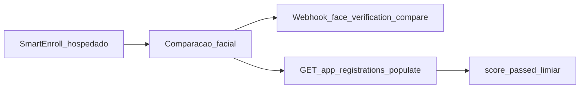

# SmartEnroll — Guia da API

Depois que um usuário conclui o KYC do **SmartEnroll hospedado**, use este guia para integrar resultados no seu backend: scores de comparação facial, liveness, webhooks e endpoints relevantes. Este é um complemento à documentação do produto — não substitui a [API SmartEnroll self-hosted](https://docs.verifik.co/smart-enroll-self-hosted).

## Visão geral do fluxo



1. O usuário final conclui documento + biometria no fluxo hospedado.
2. A Verifik executa a comparação facial (selfie vs face do documento) com os limiares do seu projeto.
3. Você recebe um webhook (se configurado) e/ou consulta o app registration com populates.
4. Você aplica suas regras de negócio com `score`, `passed` e `compare_min_score`.

## Ler scores de comparação facial

**Não existe** um `GET /v2/face-verifications/:id` público. Os scores ficam no `FaceVerification` vinculado ao app registration.

```
GET https://api.verifik.co/v2/app-registrations/{id}?populates[]=compareFaceVerification
```

Campos úteis no objeto populado:

| Campo | Significado |
| --- | --- |
| `compareFaceVerification.result.score` | Score de similaridade (0–1) |
| `compareFaceVerification.result.passed` | Se o score atingiu o limiar efetivo |
| `compareFaceVerification.result.compare_min_score` | Limiar usado nessa comparação |
| `compareFaceVerification.comparedAt` | Quando a comparação foi executada |

**TTL:** registros FaceVerification expiram em cerca de **90 dias** em produção (**10 dias** em desenvolvimento). Após expirar, `compareFaceVerification` pode vir vazio mesmo com o app registration existente.

Veja também: [Get App Registration](https://docs.verifik.co/resources/app-registrations/retrieve-an-app-registration).

### Populates úteis

Conjunto comum para um snapshot completo:

`project`, `projectFlow`, `emailValidation`, `phoneValidation`, `biometricValidation`, `documentValidation`, `person`, `face`, `documentFace`, `compareFaceVerification`, `informationValidation`

## Endpoints principais

| Endpoint | Propósito |
| --- | --- |
| [`POST /v2/face-recognition/liveness`](https://docs.verifik.co/biometrics/liveness) | Detecção de liveness padrão |
| [`POST /v2/face-recognition/liveness-score`](https://docs.verifik.co/biometrics/liveness-score) | Liveness focado no score (mesma cobrança que `/liveness`) |
| [`POST /v2/face-recognition/compare`](https://docs.verifik.co/biometrics/compare) | Comparação 1:1 (API direta) |
| [`POST /v2/face-recognition/compare-with-liveness`](https://docs.verifik.co/biometrics/compare-with-liveness) | Comparar e depois liveness (sequencial) |
| `POST /v2/face-recognition/compare/app-registration` | Comparação do fluxo hospedado: JWT com `appRegistrationId`; gallery/probe das faces armazenadas; corpo `{}` válido; limiar do project flow |
| [`GET /v2/app-registrations/:id`](https://docs.verifik.co/resources/app-registrations/retrieve-an-app-registration) | Ler o enrollment + popular scores |
| `POST /v2/biometric-validations/app-registration` | Etapa biométrica / liveness na sessão hospedada |
| `POST /v2/document-validations/app-registration` | Captura / validação de documento na sessão hospedada |
| `POST /v2/identity-images/appRegistration` | Armazenar imagens de identidade (`face`, `documentFace`, …) |

Para uma UI totalmente customizada: [SmartEnroll Self Hosted](https://docs.verifik.co/smart-enroll-self-hosted).

## Limiares de comparação facial

| Contexto | Valores |
| --- | --- |
| SmartEnroll hospedado / project flow (padrão) | **`0.85`** (`compareMinScore`) |
| API face-recognition (`compare_min_score`) | **`0.67`–`0.95`** (padrão `0.85` se omitido) |

Fotos de documentos impressos costumam corresponder a um selfie ao vivo com scores **mais baixos** do que live vs live. Se usuários genuínos falham perto de 0,7, considere reduzir o limiar do projeto após validar o risco de falsos aceites.

## `cropFace`

`cropFace` no servidor **não é suportado** nos endpoints face-recognition compare. Omita o campo (é ignorado se enviado). Envie imagens focadas no rosto ou recorte no cliente.

## Webhooks

Quando o project flow tem webhook, a comparação facial emite um evento com sufixo `face_verification_compare`. O `type` entregue é:

```
{projectFlow.type}_face_verification_compare
```

Exemplo: `onboarding_face_verification_compare`.

O payload inclui campos do app registration mais `compareResult`. Inventário completo: [Smart Enroll KYC Webhooks](https://docs.verifik.co/resources/smart-enroll-kyc-webhooks).

## Liveness / PAD (resumo do produto)

A liveness facial da Verifik usa nosso stack biométrico com detecção de ataques de apresentação (PAD). A liveness é **certificada iBeta Level 2** e alinhada com **ISO 30107 Level 1 e Level 2**. Destina-se a vetores comuns como **fotos impressas, replay de vídeo e máscaras 3D**, com verificação em imagem única. Detalhes: [Liveness](https://docs.verifik.co/biometrics/liveness) e [Liveness Score](https://docs.verifik.co/biometrics/liveness-score).

## Documentação de produto relacionada

- [SmartEnroll](https://docs.verifik.co/smartenroll) — configuração do projeto
- [SmartEnroll KYC Flow](https://docs.verifik.co/smartenroll/smartenroll-kyc-flow) — experiência do usuário final
- [SmartEnroll Admin KYC Review](https://docs.verifik.co/smartenroll/smartenroll-admin-kyc-review) — UI de revisão e interpretação de scores
- [SmartEnroll Self Hosted](https://docs.verifik.co/smart-enroll-self-hosted) — APIs de projeto/fluxo

## Receita rápida

1. Conclua (ou aguarde) o enrollment hospedado.
2. Ouça `{type}_face_verification_compare` **ou** chame `GET /v2/app-registrations/{id}?populates[]=compareFaceVerification`.
3. Leia `result.score`, `result.passed` e `result.compare_min_score`.
4. Aplique suas regras de aprovar / revisar / rejeitar (lembre-se do TTL do FaceVerification).
