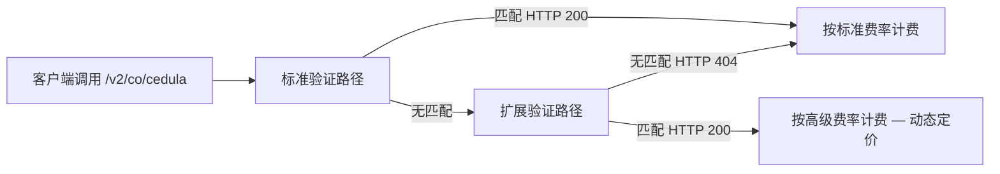

import Tabs from "@theme/Tabs";
import TabItem from "@theme/TabItem";

### 端点

```
GET https://api.verifik.co/v2/co/cedula
```

`GET https://verifik.app/v2/co/cedula` 为同一路径。亦支持 **`POST`** 提交相同字段。

### 标头

| Name | Value |
| --- | --- |
| Accept | `application/json` |
| Authorization | `Bearer <token>` |

### 证件要求

**适用对象：** 持有 *Cédula de Ciudadanía*（**CC**）的**哥伦比亚公民**，或需要从民事登记数据源获取**姓名与身份数据**的 *Permiso de Protección Temporal*（**PPT**）**委内瑞拉移民**。

| 类型 | 持有人 | `documentType` | 哥伦比亚常见长度 | 本 API 接受 |
| --- | --- | --- | --- | --- |
| **CC** | 哥伦比亚公民 | `CC` | **3–10** 位（常见 **8** 或 **10** 位 NUIP） | **5–10** 位，仅数字 |
| **PPT** | 委内瑞拉移民（本路径姓名查询） | `PPT` | 最多 **7** 位 | **5–10** 位，仅数字 |

**填写 `documentNumber`：** 仅数字 — 无点、空格或连字符。CC 示例：`1032386359`。

**请使用其他端点：**
- **CE**（*Cédula de Extranjería*）→ [哥伦比亚 CE](/verifik-zh/identity/colombia-ce)（`/v2/co/foreigner-id/ce` + `expeditionDate`）
- **PPT 移民状态**（VIGENTE / 到期）→ [哥伦比亚 PPT](/verifik-zh/identity/colombia-ppt)（`/v2/co/foreigner-id/ppt` + `expeditionDate`）
- **移民 PEP**（*Permiso Especial de Permanencia*，15 位）→ [哥伦比亚 PEP](/verifik-zh/identity/colombia-pep-id)

完整对照：[身份证件指南](/verifik-zh/identity-validation/colombia/colombia-identity-documents-guide)。

### 参数

| name | type | required | description |
| --- | --- | --- | --- |
| `documentType` | string | yes | **`CC`**（*Cédula de Ciudadanía*）或 **`PPT`**（*Permiso de Protección Temporal*）。**`NIT`**、**`CE`** 及移民 **`PEP`** **不接受** — 见 [证件指南](/verifik-zh/identity-validation/colombia/colombia-identity-documents-guide)。 |
| `documentNumber` | string | yes | 证件号码，**仅数字**（无空格或句点）。**5–10** 位（API 校验）。CC 常见 **8** 或 **10** 位；PPT 在官方记录中常为**最多 7** 位。示例：`1032386359`。 |

### 动态定价 {#dynamic-pricing}

本端点参与 Verifik 的**动态查询**架构。多数情况下按 `/v2/co/cedula` 的**标准费率**计费。当标准验证路径未返回匹配时，可能自动运行**扩展验证路径**；若该路径返回 **HTTP 200**，则适用**动态定价**，积分按该端点系列的**高级层级**扣除，而非标准层级。

**价格预期：** 从账户**标准费率** · 最高至**高级费率**（见您的套餐、Postman 或客户端面板）。



**可选计费透明：** 在请求中传递查询参数 **`includeCost=true`**。扣除积分时，若适用动态定价，响应可能包含 **`billing`** 对象：

```json
"billing": {
  "dynamicQueryApplied": true,
  "adjustmentType": "dynamic_query_premium",
  "standardCredits": 0.3,
  "chargedCredits": 2,
  "standardFeatureCode": "colombia_api_identity_lookup",
  "billedFeatureCode": "colombia_api_identity_lookup_premium"
}
```

积分数量为**示例**；实际值取决于您的套餐。

- **SLA：** [动态定价（计费）](/verifik-zh/legal/service-level-agreement#viiia-动态定价计费)
- **直接高级路由：** 请联系 Verifik 支持获取显式高级路由文档。始终按高级定价计费。

### 请求

<Tabs>
  <TabItem value="node" label="Node.js">

```javascript
import axios from "axios";

const { data } = await axios.get("https://api.verifik.co/v2/co/cedula", {
	params: { documentType: "CC", documentNumber: "123456789" },
	headers: {
		Accept: "application/json",
		Authorization: `Bearer ${process.env.VERIFIK_TOKEN}`,
	},
});
console.log(data);
```

  </TabItem>
  <TabItem value="python" label="Python">

```python
import os, requests

url = "https://api.verifik.co/v2/co/cedula"
headers = {"Accept": "application/json", "Authorization": f"Bearer {os.getenv('VERIFIK_TOKEN')}"}
params = {"documentType": "CC", "documentNumber": "123456789"}
r = requests.get(url, headers=headers, params=params)
print(r.json())
```

  </TabItem>
</Tabs>

### 响应

<Tabs>
  <TabItem value="200" label="200">

```json
{
	"data": {
		"documentType": "CC",
		"documentNumber": "123456789",
		"firstName": "Juan",
		"lastName": "Pérez",
		"fullName": "Juan Pérez",
		"status": "valid"
	},
	"signature": {
		"message": "Certified by Verifik.co",
		"dateTime": "January 16, 2024 3:44 PM"
	},
	"id": "AB123"
}
```

  </TabItem>
  <TabItem value="404" label="404">

```json
{
	"message": "Document not found",
	"code": "DOCUMENT_NOT_FOUND"
}
```

  </TabItem>
</Tabs>

### 备注

- **`CC`**：国民身份证；**`PPT`**：临时保护许可。**CE** 请使用 [哥伦比亚外国人 CE](/verifik-zh/identity/colombia-ce)。
- 扩展字段请使用 [国民身份证（扩展）](/verifik-zh/identity/colombia-full-id)。如需显式高级路由，请联系 Verifik 支持。
