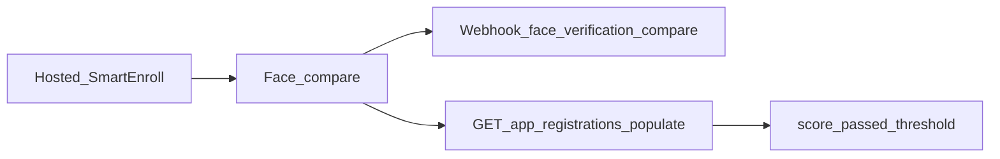

# SmartEnroll API 指南

用户完成**托管 SmartEnroll** KYC 后，可用本指南将结果接入后端：人脸比对分数、活体、Webhook 与关键端点。这是产品文档的补充，并非 [自托管 SmartEnroll API](https://docs.verifik.co/smart-enroll-self-hosted) 的完整替代。

## 流程概览



1. 终端用户在托管流程中完成证件 + 生物识别步骤。
2. Verifik 按项目阈值执行人脸比对（自拍 vs 证件人脸）。
3. 接收 Webhook（若已配置）和/或通过 populates 查询 app registration。
4. 使用 `score`、`passed`、`compare_min_score` 应用业务规则。

## 读取人脸比对分数

**不存在**公开的 `GET /v2/face-verifications/:id`。分数保存在挂到 app registration 上的 `FaceVerification`。

```
GET https://api.verifik.co/v2/app-registrations/{id}?populates[]=compareFaceVerification
```

populate 后的常用字段：

| 字段 | 含义 |
| --- | --- |
| `compareFaceVerification.result.score` | 相似度分数（0–1） |
| `compareFaceVerification.result.passed` | 是否达到有效阈值 |
| `compareFaceVerification.result.compare_min_score` | 本次比对使用的阈值 |
| `compareFaceVerification.comparedAt` | 比对执行时间 |

**TTL：** FaceVerification 记录在生产环境约 **90 天**后过期（开发环境 **10 天**）。过期后即使 app registration 仍在，`compareFaceVerification` 也可能为空。

另见：[Get App Registration](https://docs.verifik.co/resources/app-registrations/retrieve-an-app-registration)。

### 常用 populates

完整 enrollment 快照常用集合：

`project`, `projectFlow`, `emailValidation`, `phoneValidation`, `biometricValidation`, `documentValidation`, `person`, `face`, `documentFace`, `compareFaceVerification`, `informationValidation`

## 关键端点

| 端点 | 用途 |
| --- | --- |
| [`POST /v2/face-recognition/liveness`](https://docs.verifik.co/biometrics/liveness) | 标准活体检测 |
| [`POST /v2/face-recognition/liveness-score`](https://docs.verifik.co/biometrics/liveness-score) | 以分数为主的活体（计费与 `/liveness` 相同） |
| [`POST /v2/face-recognition/compare`](https://docs.verifik.co/biometrics/compare) | 1:1 人脸比对（直接 API） |
| [`POST /v2/face-recognition/compare-with-liveness`](https://docs.verifik.co/biometrics/compare-with-liveness) | 先比对再活体（顺序） |
| `POST /v2/face-recognition/compare/app-registration` | 托管路径比对：使用会话 `appRegistrationId`；gallery/probe 来自已存人脸；空 body `{}` 有效；阈值来自 project flow |
| [`GET /v2/app-registrations/:id`](https://docs.verifik.co/resources/app-registrations/retrieve-an-app-registration) | 读取 enrollment 并 populate 分数 |
| `POST /v2/biometric-validations/app-registration` | 托管会话中的生物识别 / 活体步骤 |
| `POST /v2/document-validations/app-registration` | 托管会话中的证件采集 / 校验 |
| `POST /v2/identity-images/appRegistration` | 存储身份图像（`face`、`documentFace` 等） |

完全自定义 UI 请从 [SmartEnroll Self Hosted](https://docs.verifik.co/smart-enroll-self-hosted) 开始。

## 人脸匹配阈值

| 场景 | 取值 |
| --- | --- |
| 托管 SmartEnroll / project flow 默认 | **`0.85`**（`compareMinScore`） |
| 直接 face-recognition API（`compare_min_score`） | **`0.67`–`0.95`**（省略时默认 `0.85`） |

印刷证件照片（例如哥伦比亚 CC）与活体自拍比对时，分数通常**低于**活体对活体。若真实用户在 0.7 左右失败，请在验证误通过风险后考虑降低项目阈值。

## `cropFace`

face-recognition compare 端点**不支持**服务端 `cropFace`。请省略该字段（即使发送也会被忽略）。请发送以人脸为主体的图像，或在客户端裁剪后再调用 API。

## Webhooks

当 project flow 配置了 Webhook 时，人脸比对会发出后缀为 `face_verification_compare` 的事件。送达的 `type` 为：

```
{projectFlow.type}_face_verification_compare
```

示例：`onboarding_face_verification_compare`。

载荷包含 app registration 字段以及 `compareResult`。完整清单：[Smart Enroll KYC Webhooks](https://docs.verifik.co/resources/smart-enroll-kyc-webhooks)。

## 活体 / PAD（产品摘要）

Verifik 人脸活体使用带演示攻击检测（PAD）的生物识别技术栈。活体已获 **iBeta Level 2 认证**，并符合 **ISO 30107 Level 1 与 Level 2**。旨在通过单张图像检测常见欺诈手段，如**打印照片、视频重放与 3D 面具**。详情：[Liveness](https://docs.verifik.co/biometrics/liveness)、[Liveness Score](https://docs.verifik.co/biometrics/liveness-score)。

## 相关产品文档

- [SmartEnroll](https://docs.verifik.co/smartenroll) — 项目配置
- [SmartEnroll KYC Flow](https://docs.verifik.co/smartenroll/smartenroll-kyc-flow) — 终端用户体验
- [SmartEnroll Admin KYC Review](https://docs.verifik.co/smartenroll/smartenroll-admin-kyc-review) — 审核 UI 与分数解读
- [SmartEnroll Self Hosted](https://docs.verifik.co/smart-enroll-self-hosted) — 项目/流程 API

## 快速步骤

1. 完成（或等待）托管 enrollment。
2. 监听 `{type}_face_verification_compare`，或调用 `GET /v2/app-registrations/{id}?populates[]=compareFaceVerification`。
3. 读取 `result.score`、`result.passed`、`result.compare_min_score`。
4. 应用批准 / 复核 / 拒绝规则（注意 FaceVerification TTL）。
