## 🏋️ Caso 1: Acceso a Gimnasios

### Flujo de Registro Inicial

```mermaid
sequenceDiagram
    participant U as Usuario
    participant A as App COMPENSAR
    participant V as Verifik API
    participant R as Registraduría
    participant DB as Base de Datos

    U->>A: Llega al gimnasio por primera vez
    A->>U: Solicita documento de identidad
    U->>A: Toma foto de cédula

    A->>V: POST /document-validations
    V->>V: OCR con IA (extrae datos)
    V-->>A: Datos extraídos

    A->>V: POST /colombian-citizens
    V->>R: Consulta Registraduría
    R-->>V: Datos oficiales
    V->>V: Valida matching (>90%)
    V-->>A: Validación exitosa

    A->>U: Solicita selfie para liveness
    U->>A: Toma selfie

    A->>V: POST /biometric-validations
    V->>V: Liveness detection (score &gt;0.6)
    V->>V: Crea perfil facial
    V->>DB: Guarda en colección gimnasio
    V-->>A: Registro exitoso

    A->>U: ✅ Registro completado
```

**Diagrama Renderizado:**


### Flujo de Acceso Diario

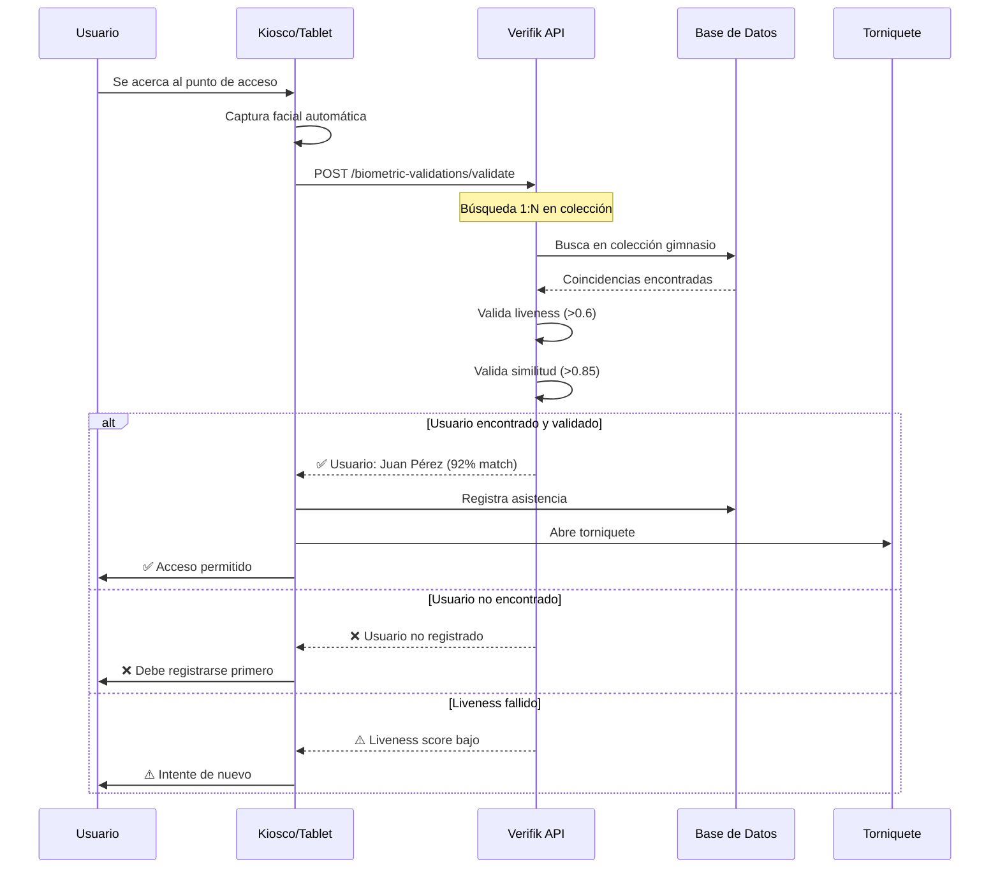

**Diagrama Renderizado:**


---

## 💳 Caso 2: Validación de Identidad en Créditos

### Flujo Completo de Validación

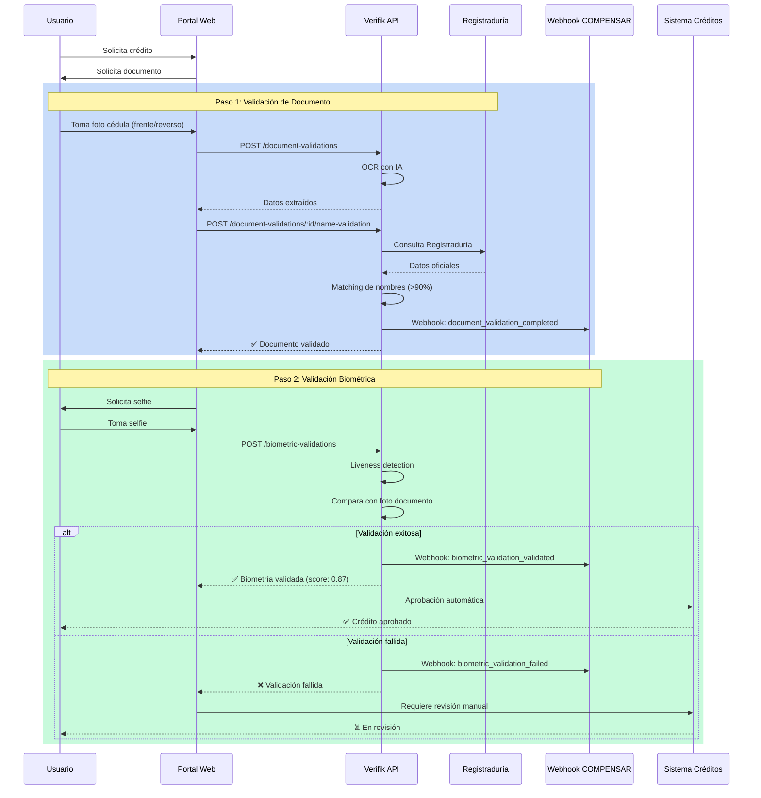

**Diagrama Renderizado:**


### Comparación: BPO Actual vs Verifik Automatizado

```mermaid
graph TB
    subgraph "Solución Actual (BPO)"
        A1[Usuario envía documento] --> A2[Operador BPO recibe]
        A2 --> A3[Operador valida manualmente]
        A3 --> A4{¿Válido?}
        A4 -->|Sí| A5[Aprobación manual]
        A4 -->|No| A6[Rechazo manual]
        A5 --> A7[Tiempo: 2-5 min]
        A6 --> A7
        A7 --> A8[Costo: Alto]
        A8 --> A9[Disponibilidad: Horario laboral]
    end

    subgraph "Solución Verifik (Automatizada)"
        B1[Usuario envía documento] --> B2[OCR con IA]
        B2 --> B3[Validación Registraduría]
        B3 --> B4[Liveness + Facial]
        B4 --> B5{¿Válido?}
        B5 -->|Sí| B6[Aprobación automática]
        B5 -->|No| B7[Revisión manual solo si necesario]
        B6 --> B8[Tiempo: &lt;30 seg]
        B7 --> B8
        B8 --> B9[Costo: -70%]
        B9 --> B10[Disponibilidad: 24/7]
    end

    style A7 fill:#ffcccc
    style A8 fill:#ffcccc
    style A9 fill:#ffcccc
    style B8 fill:#ccffcc
    style B9 fill:#ccffcc
    style B10 fill:#ccffcc
```

---

## 🏢 Caso 3: Control de Acceso a Sedes

### Flujo de Registro de Empleado

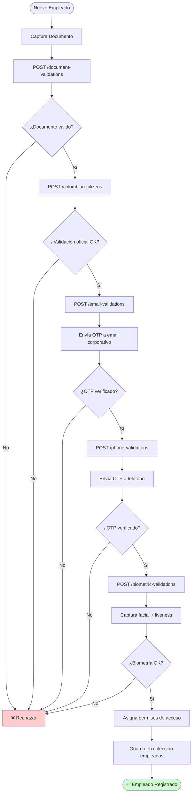

**Diagrama Renderizado:**


### Flujo de Acceso Diario a Sede

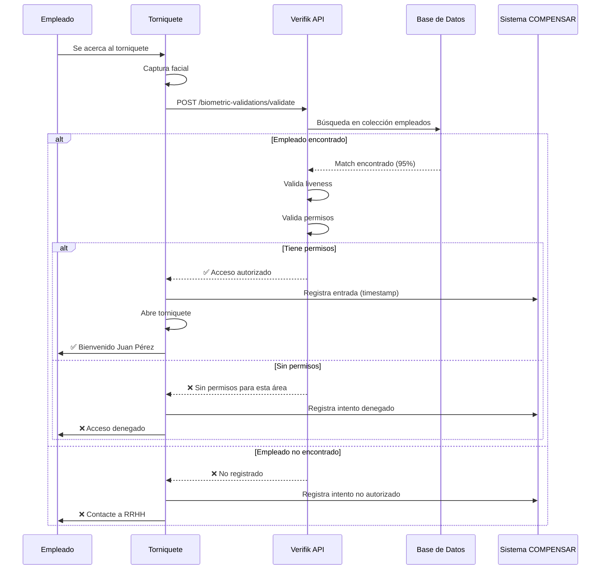

**Diagrama Renderizado:**


---

## 📱 Caso 4: Trámites Digitales

### Flujo de Validación Completa

```mermaid
flowchart LR
    Start([Usuario inicia trámite]) --> A[Validación Documento]

    subgraph "Validación de Documento"
        A --> A1[POST /document-validations]
        A1 --> A2[OCR + Extracción]
        A2 --> A3[POST /colombian-citizens]
        A3 --> A4{¿Válido?}
    end

    A4 -->|No| Reject[❌ Rechazar]
    A4 -->|Sí| B[Validación Email]

    subgraph "Validación de Email"
        B --> B1[POST /email-validations]
        B1 --> B2[Envía OTP]
        B2 --> B3[Usuario ingresa código]
        B3 --> B4{¿Correcto?}
    end

    B4 -->|No| Reject
    B4 -->|Sí| C[Validación Teléfono]

    subgraph "Validación de Teléfono"
        C --> C1[POST /phone-validations]
        C1 --> C2[Envía OTP SMS/WhatsApp]
        C2 --> C3[Usuario ingresa código]
        C3 --> C4{¿Correcto?}
    end

    C4 -->|No| Reject
    C4 -->|Sí| D[Validación Biométrica]

    subgraph "Validación Biométrica"
        D --> D1[POST /biometric-validations]
        D1 --> D2[Captura selfie]
        D2 --> D3[Liveness + Facial]
        D3 --> D4{¿Válido?}
    end

    D4 -->|No| Reject
    D4 -->|Sí| Success[✅ Trámite Aprobado]

    style Reject fill:#ffcccc
    style Success fill:#ccffcc
```

**Diagrama Renderizado:**


---

## 🔄 Arquitectura del Sistema

### Vista de Alto Nivel

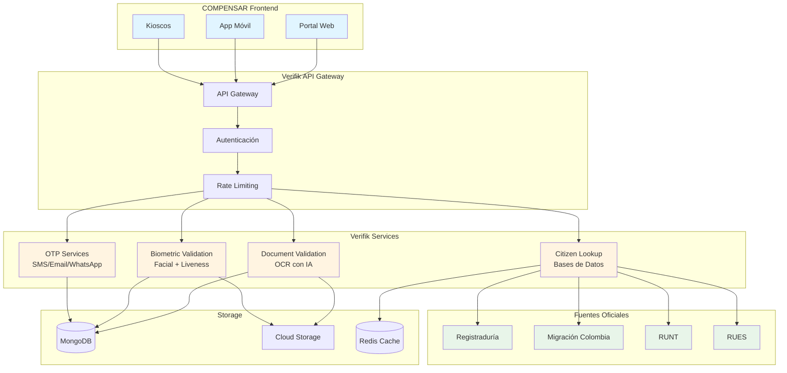

### Flujo de Datos - Validación de Documento

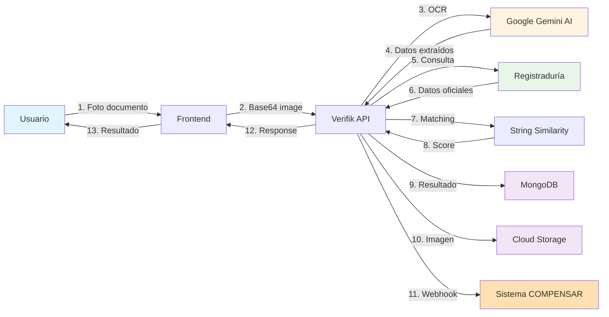

---

## 🔐 Flujo de Autenticación

### Autenticación con API Key

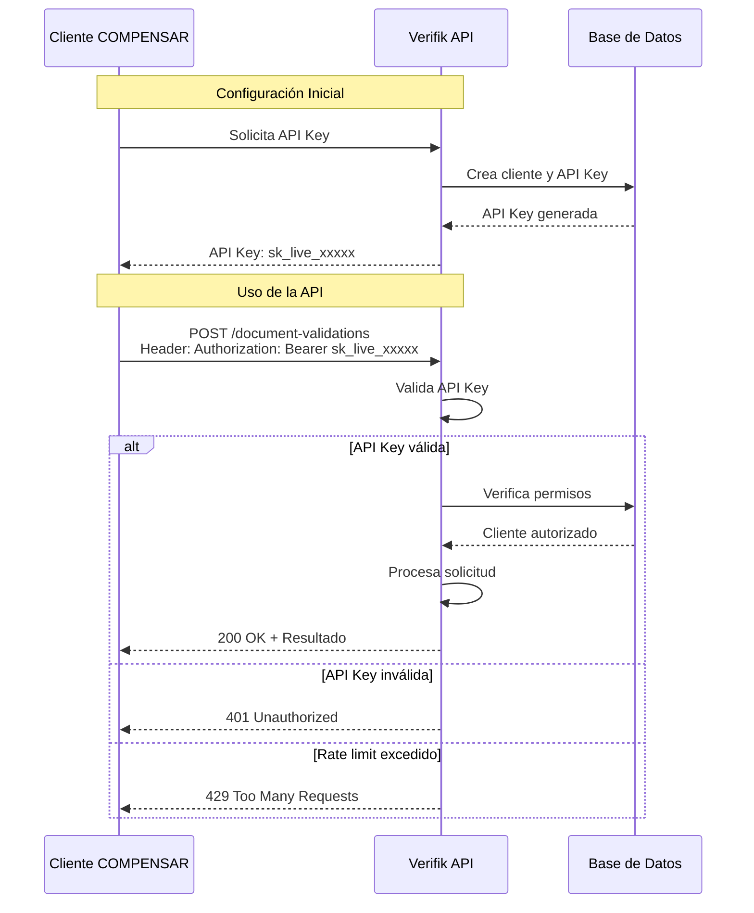

---

## 📊 Flujo de Webhooks

### Configuración y Notificaciones

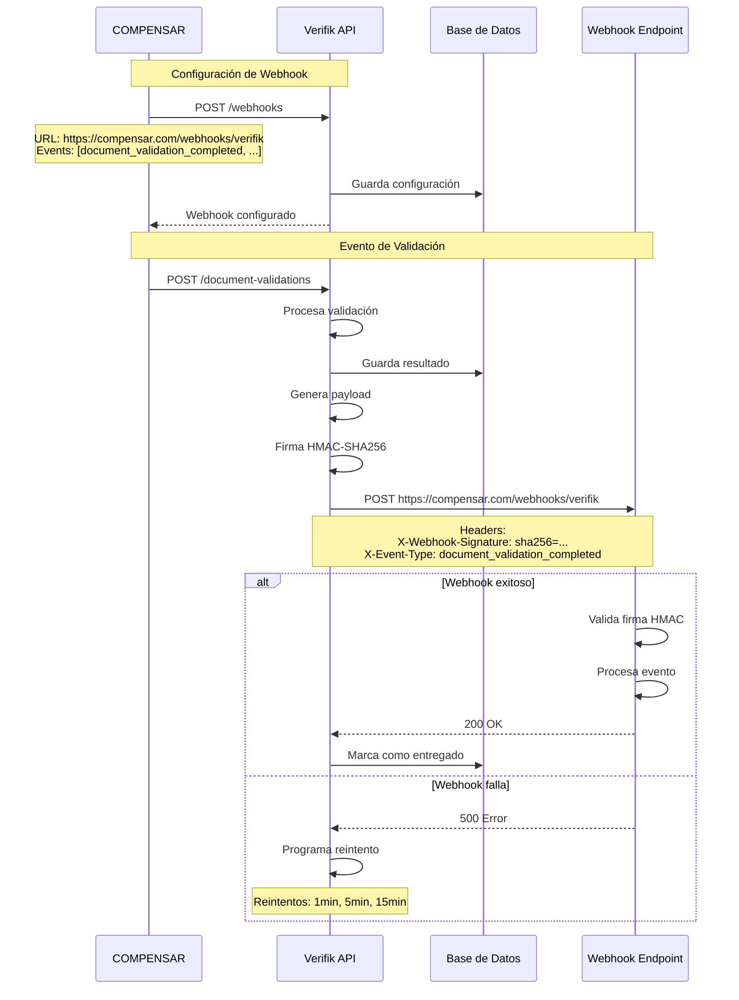

---

## 🎯 Decisiones de Validación

### Árbol de Decisión - Validación de Documento

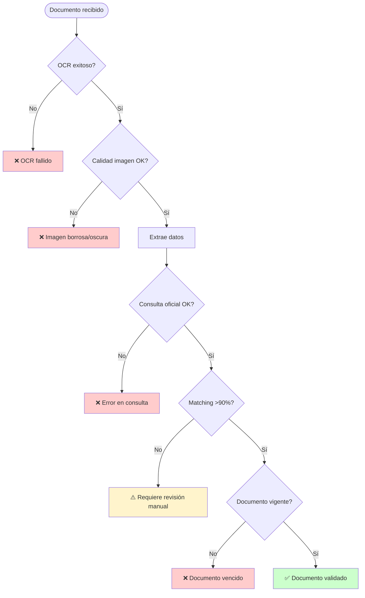

### Árbol de Decisión - Validación Biométrica

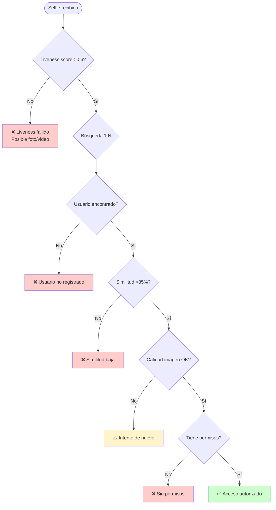

---

## 📈 Métricas y Monitoreo

### Dashboard de Métricas

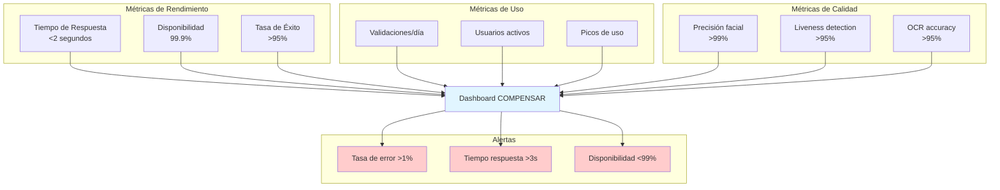

---

## 🔄 Plan de Implementación

### Timeline de 12 Semanas

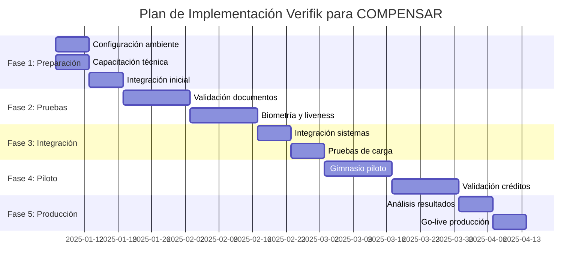

---

_Diagramas preparados por Verifik - Diciembre 2024_  
_Versión 1.0_

**Nota:** Estos diagramas están en formato Mermaid y se renderizan automáticamente en GitHub, GitLab, y la mayoría de visores de Markdown modernos.
