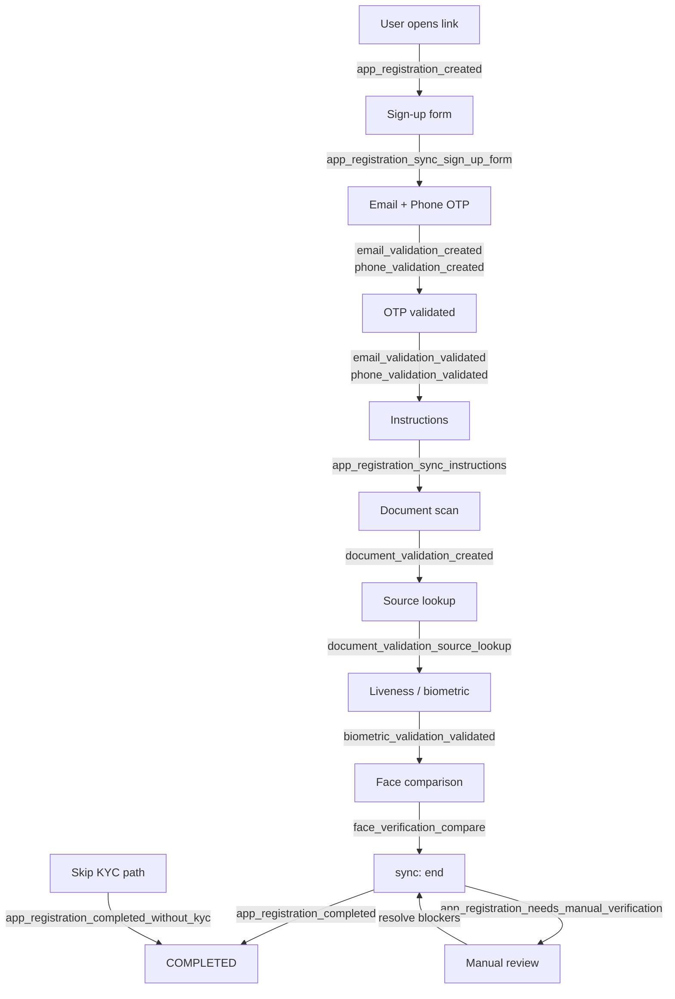

### Overview

Smart Enroll (onboarding) uses the **webhook** attached to the **ProjectFlow**. When the flow has an active webhook, Verifik enqueues delivery for lifecycle events on app registration, email/phone OTP, documents, biometrics, and related modules.

For the full event catalog see [Supported Events](/resources/supported-events). This page focuses on **typical Smart Enroll order**, **payload shape**, and **manual verification vs. completed** behavior.

**Also available:** [Versión en español](/verifik-es/resources/smart-enroll-kyc-webhooks).

:::info Payload shape

Every delivery is JSON with a top-level **`type`** and **`object`**:

```json
{
  "type": "onboarding_app_registration_completed",
  "object": { }
}
```

- **`type`** = `${projectFlow.type}_${suffix}` — for Smart Enroll the prefix is always **`onboarding`**.
- **`object`** = primary entity snapshot (`appRegistration`, `emailValidation`, `documentValidation`, etc.). **OTP values are stripped.**
- `app_registration_*` events from **sync** also include the `webhook` reference when the flow is linked to one.

Your integration should tolerate new optional fields.

:::

:::tip Event name rules

| Pattern | Suffix shape | Example |
| --- | --- | --- |
| **Sync** while status stays **`ONGOING`** | `app_registration_sync_<step>` (snake_case) | `app_registration_sync_sign_up_form` |
| **Sync** when status **changes** (`end`, `skipKYC`) | `app_registration_<status>` | `app_registration_completed` |
| **Admin override** (staff auth) | `app_registration_<new_status>` | `app_registration_completed` |
| **Email / Phone** OTP | `email_validation_<action>` or `phone_validation_<action>` | `email_validation_validated` |

All suffixes become full `type` with the `onboarding_` prefix, e.g. `onboarding_email_validation_created`. Match on the **full type** in your code.

:::

---

### Smart Enroll timeline

Order varies by project (optional steps, skip KYC, gateways). The diagram below shows a **common happy path** and where major events fire.



---

### Lifecycle events in order

The table below lists events in the **order they typically fire** during a Smart Enroll flow.

| # | Suffix | When it fires | Notes |
| --- | --- | --- | --- |
| 1 | `app_registration_created` | Registration record is created (insert) | Includes `projectFlow` context |
| 2 | `app_registration_sync_sign_up_form` | User submits sign-up form via **sync** | Status stays `ONGOING` |
| 3 | `email_validation_created` | First OTP email sent | |
| 3a | `email_validation_resend` | Resend while previous OTP still valid | |
| 3b | `email_validation_validated` | Correct OTP submitted | |
| 3c | `email_validation_otp_incorect` | Wrong OTP | Spelling matches API |
| 4 | `phone_validation_created` | First OTP message (SMS / WhatsApp) | |
| 4a | `phone_validation_resend` | Resend for same pending validation | |
| 4b | `phone_validation_validated` | Correct OTP | |
| 4c | `phone_validation_otp_incorect` | Wrong OTP | |
| 5 | `app_registration_sync_instructions` | Instructions step via **sync** | Status stays `ONGOING` |
| 6 | `document_validation_created` | Document validation starts | May include `appRegistration`, `email`, `phone` |
| 7 | `document_validation_source_lookup` | Government / data source lookup finishes | |
| 7a | `document_validation_data_source_error` | Source returned invalid data or name mismatch | May include `notSupportedData` |
| 8 | `biometric_validation_validated` | Liveness passes | |
| 8a | `biometric_validation_liveness_failed` | Liveness fails | |
| 8b | `biometrics_liveness_score_not_acceptable` | Score below project threshold | |
| 9 | `face_verification_compare` | Face compare (selfie vs document) | Includes `compareResult` |
| 10 | `document_validation_manual_verification_required` | Document moved to manual review | Blocks `COMPLETED` |
| 11 | **`app_registration_completed`** | **sync** `end` — all requirements met | Final success event |
| 11 | **`app_registration_needs_manual_verification`** | **sync** `end` — blockers remain | See warning below |
| 11 | **`app_registration_completed_without_kyc`** | **skipKYC** path, flow allows skip | |
| 11 | **`app_registration_failed`** | **sync** `end` — completeness = `FAILED` | |

---

### Manual verification vs. `COMPLETED`

:::warning Key behavior

- **`NEEDS_MANUAL_VERIFICATION`** means the registration is **blocked** from completing until ops resolve outstanding checks (e.g. document manual verification).
- Do **not** assume every **`sync` `end`** with `status: "COMPLETED"` in the request yields `app_registration_completed`. The server sets status from **completeness and flow rules** and may emit `app_registration_needs_manual_verification` instead.
- After blockers are cleared, a subsequent **sync** or **adminOverride** can move the registration to `COMPLETED` and emit `app_registration_completed`.
- Real delivery order over the network can differ by milliseconds — design for idempotency.

:::

---

### Related resources

- [Supported Events](/resources/supported-events) — full event catalog with reference tables
- [Webhook integration](/resources/webhook-integration) — sample receiver server
- [Webhooks overview](/resources/webhooks)
