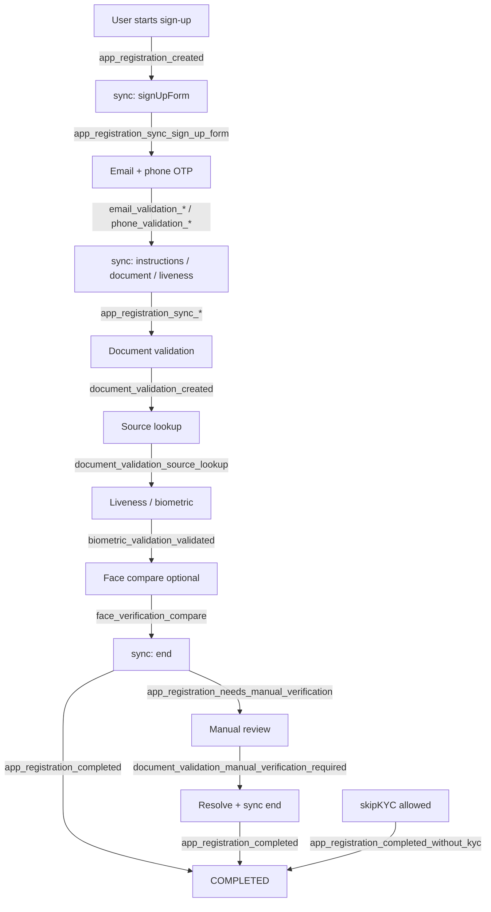

import Tabs from "@theme/Tabs";
import TabItem from "@theme/TabItem";

### Overview

This page lists webhook **event suffixes** Verifik can emit. Your HTTP listener receives a **`type`** built as **`${projectFlow.type}_${suffix}`** (for Smart Enroll flows, `projectFlow.type` is usually `onboarding`, so you see `onboarding_email_validation_created`, not only `email_validation_created`).

**Spanish:** [Eventos soportados](/verifik-es/resources/eventos-soportados).

:::info HTTP request body

Every delivery is an HTTP **POST** to your ProjectFlow webhook URL with JSON:

```json
{
  "type": "onboarding_email_validation_created",
  "object": { }
}
```

- **`type`** — Full string: **`${projectFlow.type}_${suffix}`**. Match on this value in your code.
- **`object`** — Primary entity snapshot (IDs and fields). **OTP values are stripped** before send.

Nothing is queued if the flow has **no** webhook or the code path does not attach one.

:::

:::tip Quick rule

Tables below show the **`suffix`** only. Your logs will show the **prefixed** `type` (e.g. `onboarding_…` or `login_…`).

:::

### Typical onboarding timeline

Order varies by project (optional steps, skip KYC, gateways). This diagram shows a **common** happy path and where major events appear. Parallel steps (email vs phone) are simplified.



:::warning Manual verification vs completed

If the registration or document is in **`NEEDS_MANUAL_VERIFICATION`**, **`sync`** with `step: "end"` may emit **`app_registration_needs_manual_verification`** instead of **`app_registration_completed`** until blockers are cleared. A second **`completed`** event can arrive later after resolution and another **`sync`** (or **`adminOverride`**). Real delivery order over the network can differ by milliseconds.

:::

---

### Reference tables (by lifecycle order)

#### 1. App registration (`app_registration_*`)

| Event suffix | When it fires | Main `object` entity | Notes |
| --- | --- | --- | --- |
| `app_registration_created` | New registration after insert / init | `appRegistration` | Includes `projectFlow` context when populated |
| `app_registration_sync_<step>` | **`sync`** while status stays **`ONGOING`** | `appRegistration` | `<step>` is snake_case: e.g. `sign_up_form`, `instructions`, `document`, `liveness`, `skip_kyc` |
| `app_registration_completed` | **`sync`** `end` (or staff path) when requirements pass and status becomes **`COMPLETED`** | `appRegistration` | |
| `app_registration_needs_manual_verification` | **`sync`** `end` (or rules) when blocked by manual review / completeness | `appRegistration` | |
| `app_registration_completed_without_kyc` | **`skipKYC`** when flow allows skip and status **`COMPLETED_WITHOUT_KYC`** | `appRegistration` | |
| `app_registration_failed` | **`sync`** `end` with request **`FAILED`** when completeness allows that outcome | `appRegistration` | |
| `app_registration_person_already_set` | Liveness/person attach when person already linked | `appRegistration` | Error shape: `error`, `statusCode`, `message` |

#### 2. Email validation (`email_validation_*`)

| Event suffix | When it fires | Main `object` entity | Notes |
| --- | --- | --- | --- |
| `email_validation_created` | First OTP email sent | `emailValidation` | |
| `email_validation_resend` | Resend OTP while prior send still valid | `emailValidation` | Second send for same pending validation |
| `email_validation_validated` | Correct OTP (or valid demo OTP on demo projects) | `emailValidation` | |
| `email_validation_failed` | Status moves to failed | `emailValidation` | Part of `email_validation_{status}` pattern |
| `email_validation_otp_incorect` | Wrong OTP submitted | `emailValidation` | Spelling **`incorect`** matches API |
| `email_validation_expired` | Session expired (~10 min) | `emailValidation` | |

#### 3. Phone validation (`phone_validation_*`)

| Event suffix | When it fires | Main `object` entity | Notes |
| --- | --- | --- | --- |
| `phone_validation_created` | First OTP message sent (SMS/WhatsApp) | `phoneValidation` | |
| `phone_validation_resend` | Resend OTP for same pending validation | `phoneValidation` | Cooldown may apply; **`force`** can bypass in API |
| `phone_validation_validated` | Correct OTP | `phoneValidation` | |
| `phone_validation_failed` | Status moves to failed | `phoneValidation` | Part of `phone_validation_{status}` pattern |
| `phone_validation_otp_incorect` | Wrong OTP | `phoneValidation` | |
| `phone_validation_expired` | Session expired | `phoneValidation` | |

#### 4. Document validation (`document_validation_*`)

| Event suffix | When it fires | Main `object` entity | Notes |
| --- | --- | --- | --- |
| `document_validation_created` | New document validation started | `documentValidation` | Often includes `appRegistration`, `email`, `phone` |
| `document_validation_source_lookup` | Government / data source lookup finished | `documentValidation` | |
| `document_validation_data_source_error` | Source returned invalid/empty or name mismatch | `documentValidation` | May include `isSupported`, `infoValidationSupportedReason`, `notSupportedData` |
| `document_validation_manual_verification_required` | Document moved to manual review | `documentValidation` | Linked app registration may become **`NEEDS_MANUAL_VERIFICATION`** |

#### 5. Biometric validation (`biometric_validation_*` and related)

| Event suffix | When it fires | Main `object` entity | Notes |
| --- | --- | --- | --- |
| `biometric_validation_new` | Status **`new`** | `biometricValidation` | Dynamic: `biometric_validation_{status}` |
| `biometric_validation_validated` | Status **`validated`** | `biometricValidation` | |
| `biometric_validation_failed` | Status **`failed`** | `biometricValidation` | |
| `biometric_validation_created_person` | Person created from biometric flow | `biometricValidation` | |
| `biometric_validation_liveness_failed` | Liveness step failed explicitly | `biometricValidation` | |
| `biometrics_liveness_score_not_acceptable` | Liveness score below project threshold | `biometricValidation` | Payload may include `projectFlow` |

#### 6. Face verification (`face_verification_*`)

| Event suffix | When it fires | Main `object` entity | Notes |
| --- | --- | --- | --- |
| `face_verification_compare` | Face compare finished (e.g. selfie vs document) | `appRegistration` | Includes **`compareResult`** |

#### 7. Information validation (`information_validation_*`)

| Event suffix | When it fires | Main `object` entity | Notes |
| --- | --- | --- | --- |
| `information_validation_background_check` | Background / criminal checks completed | `informationValidation` | |
| `information_validation_updated` | Data synced from document-driven flows | `informationValidation` | Emission depends on webhook context on document/flow |

---

### Full `type` examples

<Tabs>
  <TabItem value="onboarding" label="Onboarding (Smart Enroll)" default>

| Suffix (from tables) | Example full `type` |
| --- | --- |
| `email_validation_created` | `onboarding_email_validation_created` |
| `app_registration_sync_sign_up_form` | `onboarding_app_registration_sync_sign_up_form` |
| `app_registration_completed` | `onboarding_app_registration_completed` |

  </TabItem>
  <TabItem value="login" label="Login flows">

If `projectFlow.type` is **`login`**, the same suffix becomes e.g. `login_email_validation_created`.

  </TabItem>
</Tabs>

### Related pages

- [Smart Enroll (KYC) webhooks](/resources/smart-enroll-kyc-webhooks) — narrative timeline and manual vs completed behavior
- [Webhook integration](/resources/webhook-integration) — sample receiver server
- [Webhooks overview](/resources/webhooks)
