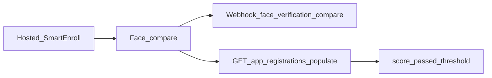

# SmartEnroll API Companion

After a user completes **hosted SmartEnroll** KYC, use this guide to pull results into your backend: face-match scores, liveness, webhooks, and the endpoints that matter. This is a companion to the product docs—not a full rewrite of the [self-hosted SmartEnroll API](/smart-enroll-self-hosted).

## Flow overview



1. The end user finishes document + biometric steps in the hosted flow.
2. Verifik runs face comparison (selfie vs document face) using your project thresholds.
3. You receive a webhook (if configured) and/or poll the app registration with populates.
4. You apply your business rules using `score`, `passed`, and `compare_min_score`.

## Reading face-comparison scores

There is **no** public `GET /v2/face-verifications/:id`. Face scores live on the `FaceVerification` linked from the app registration.

```
GET https://api.verifik.co/v2/app-registrations/{id}?populates[]=compareFaceVerification
```

Useful fields on the populated object:

| Field | Meaning |
| --- | --- |
| `compareFaceVerification.result.score` | Similarity score (0–1) |
| `compareFaceVerification.result.passed` | Whether the score met the effective threshold |
| `compareFaceVerification.result.compare_min_score` | Threshold used for that compare |
| `compareFaceVerification.comparedAt` | When the compare ran |

**TTL:** FaceVerification records expire after about **90 days** in production (**10 days** in development). After expiry, `compareFaceVerification` may be empty even if the app registration remains.

Also see [Get App Registration](/resources/app-registrations/retrieve-an-app-registration).

### Useful populates

Common set for a full enrollment snapshot:

`project`, `projectFlow`, `emailValidation`, `phoneValidation`, `biometricValidation`, `documentValidation`, `person`, `face`, `documentFace`, `compareFaceVerification`, `informationValidation`

## Key endpoints

| Endpoint | Purpose |
| --- | --- |
| [`POST /v2/face-recognition/liveness`](/biometrics/liveness) | Standard liveness detection |
| [`POST /v2/face-recognition/liveness-score`](/biometrics/liveness-score) | Score-focused liveness (same billing as `/liveness`) |
| [`POST /v2/face-recognition/compare`](/biometrics/compare) | 1:1 face compare (direct API) |
| [`POST /v2/face-recognition/compare-with-liveness`](/biometrics/compare-with-liveness) | Compare then liveness (sequential) |
| `POST /v2/face-recognition/compare/app-registration` | Hosted-path compare: uses session `appRegistrationId`; gallery/probe from stored faces; empty body `{}` is valid; threshold from project flow |
| [`GET /v2/app-registrations/:id`](/resources/app-registrations/retrieve-an-app-registration) | Read enrollment + populate scores |
| `POST /v2/biometric-validations/app-registration` | SmartEnroll biometric / liveness step in the hosted session |
| `POST /v2/document-validations/app-registration` | Document capture / validation in the hosted session |
| `POST /v2/identity-images/appRegistration` | Store identity images (`face`, `documentFace`, …) |

For building a fully custom UI, start with [SmartEnroll: Self Hosted](/smart-enroll-self-hosted).

## Face-match thresholds

| Context | Values |
| --- | --- |
| Hosted SmartEnroll / project flow default | **`0.85`** (`compareMinScore`) |
| Direct face-recognition API (`compare_min_score`) | **`0.67`–`0.95`** (default `0.85` if omitted) |

Printed document photos (for example a Colombian CC) often match a live selfie at **lower** scores than live-vs-live. If genuine users fail around the mid‑0.7s, consider lowering the project threshold after validating false-accept risk.

## `cropFace`

Server-side `cropFace` is **not supported** on face-recognition compare endpoints. Omit the field (it is ignored if sent). Send face-focused images, or crop client-side before calling the API.

## Webhooks

When the project flow has a webhook configured, face compare emits an event with suffix `face_verification_compare`. The delivered `type` is:

```
{projectFlow.type}_face_verification_compare
```

Example: `onboarding_face_verification_compare`.

The payload includes app registration fields plus `compareResult` (the FaceVerification outcome). Full SmartEnroll webhook inventory: [Smart Enroll KYC Webhooks](/resources/smart-enroll-kyc-webhooks).

## Liveness / PAD (product summary)

Verifik’s face liveness uses our biometric stack with presentation attack detection (PAD). Liveness is **iBeta Level 2 certified** and aligned with **ISO 30107 Level 1 and Level 2**. It is designed to detect common spoofing vectors such as **printed photos, video replay, and 3D masks**, using a single-image liveness check. Details: [Liveness](/biometrics/liveness) and [Liveness Score](/biometrics/liveness-score).

## Related product docs

- [SmartEnroll](/smartenroll) — project configuration
- [SmartEnroll KYC Flow](/smartenroll/smartenroll-kyc-flow) — end-user experience
- [SmartEnroll Admin KYC Review](/smartenroll/smartenroll-admin-kyc-review) — reviewer UI and score interpretation
- [SmartEnroll: Self Hosted](/smart-enroll-self-hosted) — programmatic project/flow APIs

## Quick recipe

1. Complete (or wait for) the hosted enrollment.
2. Listen for `{type}_face_verification_compare` **or** call `GET /v2/app-registrations/{id}?populates[]=compareFaceVerification`.
3. Read `result.score`, `result.passed`, and `result.compare_min_score`.
4. Apply your approve / review / reject rules (remember FaceVerification TTL).
