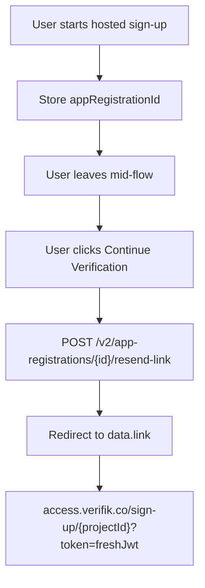

# Resume an Incomplete Enrollment

When a user starts **hosted SmartEnroll** and leaves before finishing, do **not** send them back through the create form with the same email or phone. That creates a new registration attempt and returns `409:email_is_registered_already` ("Email is already registered").

Store the App Registration `_id` from the first session. When the user clicks **Continue Verification**, mint a fresh hosted URL with [Resend an App Registration Link](/resources/app-registrations/resend-an-app-registration-link) and redirect them to `data.link`.

## Partner flow



1. The user opens `https://access.verifik.co/sign-up/{projectId}` (or you create the registration via `POST /v2/app-registrations`).
2. Persist `appRegistrationId` (and optionally the first token) in your application.
3. If the user returns later, call `POST /v2/app-registrations/{id}/resend-link` with your **client API token**.
4. Redirect the browser to `data.link`. The hosted app loads the existing registration and continues from the current step (email, phone, document, liveness, and so on).

The Verifik admin **Resend link** action (copy link or send email) calls the same endpoint.

## Hosted URL and tokens

Resume and first start use the **same path**:

```
https://access.verifik.co/sign-up/{projectId}?token={jwt}
```

The token is what changes.

| Token | Lifetime | Use |
| --- | --- | --- |
| Create token from `POST /v2/app-registrations` | **120 minutes** | First session only. Reuse the original URL while this JWT is still valid. |
| Continuation token from `POST .../resend-link` | **30 minutes** | Recommended resume. Always mint a new one when the user comes back. |

After the create token expires, the hosted app drops `?token=` and shows the sign-up form again. Submitting that form with the same email or phone is what triggers **already registered**.

`GET /v2/app-registrations/{id}` and `PUT /v2/app-registrations/{id}/sync` do **not** return a hosted continuation URL. Sync advances steps **inside** an active session; it is not how you send a user back into the hosted flow.

## What not to use

| Mechanism | Role |
| --- | --- |
| `POST /v2/app-registrations` again with the same email/phone | Creates a conflict (`email_is_registered_already` / `phone_is_registered_already`) |
| `smartLink` on the App Registration object | OneTimeLink product on `link.verifik.co`, not hosted SmartEnroll resume |
| `PUT /{id}/sync` | In-session step/status updates |
| `POST /{id}/regenerate-token` | Staff / super-admin only |
| `POST /resume-kyc` | Verifik client billing KYC restart (resets document and liveness). Not the partner resume API |

## Statuses you can resume

`resend-link` works for incomplete registrations such as `STARTED` and `ONGOING`. Client tokens cannot resend for `COMPLETED`, `COMPLETED_WITHOUT_KYC`, or `FAILED`.

## Related

- [Resend an App Registration Link](/resources/app-registrations/resend-an-app-registration-link) — request and response contract
- [Create an App Registration](/resources/app-registrations/create-an-app-registration) — first session and create-token lifetime
- [SmartEnroll KYC Flow](/smartenroll/smartenroll-kyc-flow) — end-user steps
- [SmartEnroll API Companion](/smartenroll/api-companion) — scores and webhooks after KYC
