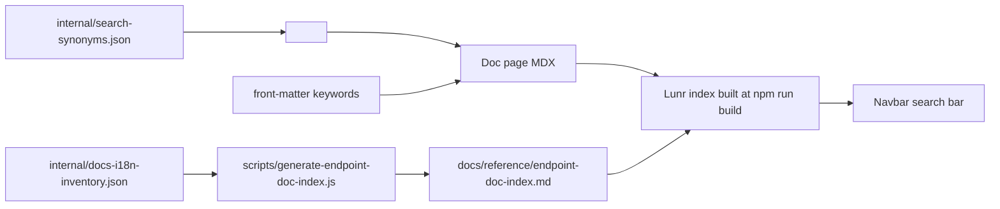

# Docs search backend (audit + plan)

## Current state (audit performed 2026-05-07)

- The navbar exposes a search box via `type: "search"` in
  [`docusaurus.config.js`](../docusaurus.config.js) (`navbar.items`).
- **No `themeConfig.algolia` block** is configured. With
  `@docusaurus/preset-classic`, the Algolia search theme is only loaded when
  `themeConfig.algolia` exists
  ([preset-classic/lib/index.js:24-26](../node_modules/@docusaurus/preset-classic/lib/index.js)).
  And `theme-search-algolia` requires `appId`, `apiKey`, and `indexName`
  ([validateThemeConfig.js:28-32](../node_modules/@docusaurus/theme-search-algolia/lib/validateThemeConfig.js)).
- The `docsearch:language` and `docsearch:docusaurus_tag` meta tags visible in
  built HTML come from `@docusaurus/theme-classic`'s `SearchMetadata`
  component, not from an active Algolia plugin.

**Conclusion:** there is no working search engine wired up today. The navbar
icon either renders nothing or a non-functional placeholder.

## Chosen backend: build-time local search (no AI)

We use [`@easyops-cn/docusaurus-search-local`](https://github.com/easyops-cn/docusaurus-search-local).

Why this and not Algolia DocSearch:

- No external account / crawl approval needed; everything ships with the
  static build.
- Indexes **all docs plugins** (English, Spanish, partial locales) by their
  `routeBasePath`.
- Lunr-based; supports `keywords` front matter and content tokens. Synonyms
  are handled by **rendering them into the page** via `<SearchKeywords>`
  (see `SEARCH_CONTRIBUTING.md`).

### Configuration in `docusaurus.config.js`

The plugin is registered under `themes` with all
`docsRouteBasePath` values listed:

```js
themes: [
  [
    require.resolve("@easyops-cn/docusaurus-search-local"),
    {
      hashed: true,
      indexBlog: true,
      indexPages: false,
      docsRouteBasePath: [
        "/",            // English (routeBasePath: "")
        "verifik-es",
        "docs-es",
        "doc-es",
        "verifik-fr",
        "verifik-pt",
        "verifik-ko",
        "verifik-ja",
        "verifik-zh",
        "recursos",
      ],
      language: ["en", "es"],
      highlightSearchTermsOnTargetPage: true,
      explicitSearchResultPath: true,
    },
  ],
],
```

Ensure no `themeConfig.algolia` is added unless DocSearch is also enabled —
the two themes can coexist but it is a separate decision.

## How the pieces fit together



## Migrating to Algolia DocSearch later

If/when DocSearch is approved:

1. Add `themeConfig.algolia` with `appId`, `apiKey`, `indexName` (set via env
   vars at build, e.g. on Vercel).
2. Disable or keep the local plugin — they can coexist via
   `searchBarPosition` overrides if needed.
3. Paste the country and product synonyms from
   `internal/search-synonyms.json` into the **Algolia dashboard → Synonyms**.
4. Use `searchParameters.facetFilters: ["language:en"]` (or `es`) per-locale.

The repo-resident synonym file is already shaped to make that migration
mechanical.
