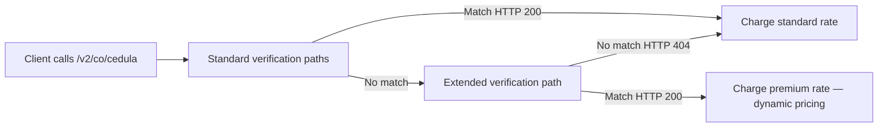

# Colombian Citizen
**API path(s):** /v2/co/cedula, /v2/co/foreigner-id/ce, /v2/co/foreigner-id/ppt, /v2/co/procuraduria

## Parameters

| Name | Type | Required | Description |
| --- | --- | --- | --- |
| `documentType` | string | Yes | One of **`CC`**, **`CE`**, **`PPT`**, **`NIT`**, **`PEP`**. See the [documents guide](/identity-validation/colombia/colombia-identity-documents-guide). |
| `documentNumber` | string | Yes | Document number, **digits only** (no spaces or periods). **5–10** characters (API validation). CC is commonly **8** or **10** digits; PPT is often **up to 7** digits in official records. Example: `1032386359`. |

### Dynamic pricing {#dynamic-pricing}

This endpoint participates in Verifik's **Dynamic Query** architecture. In most cases you pay the **standard rate** for `/v2/co/cedula`. When standard verification paths do not return a match, an **extended verification path** may run automatically. If that path returns **HTTP 200**, **dynamic pricing** applies and credits are deducted at the **premium tier** for this endpoint family—not the standard tier.

**Price expectation:** From your account's **standard rate** · up to **premium rate** (see your plan, Postman, or the client panel).



**Optional billing transparency:** pass query parameter **`includeCost=true`** on your request. When credits are charged, the response may include a **`billing`** object when dynamic pricing applies:

```json
"billing": {
  "dynamicQueryApplied": true,
  "adjustmentType": "dynamic_query_premium",
  "standardCredits": 0.3,
  "chargedCredits": 2,
  "standardFeatureCode": "colombia_api_identity_lookup",
  "billedFeatureCode": "colombia_api_identity_lookup_premium"
}
```

Credit amounts are **illustrative**; actual values depend on your plan.

- **SLA:** [Dynamic pricing (billing)](/legal/service-level-agreement#dynamic-pricing-billing)
- **Direct premium route:** Contact Verifik support for the explicit premium route documentation. It always uses premium pricing.
