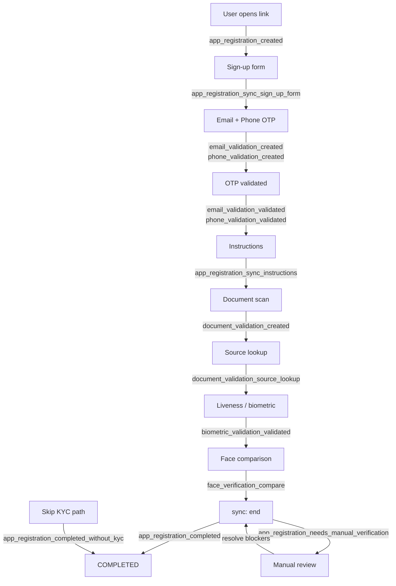

# Smart Enroll (KYC) webhooks

## Smart Enroll timeline

Order varies by project (optional steps, skip KYC, gateways). The diagram below shows a **common happy path** and where major events fire.

---

### Lifecycle events in order

The table below lists events in the **order they typically fire** during a Smart Enroll flow.

| # | Suffix | When it fires | Notes |
| --- | --- | --- | --- |
| 1 | `app_registration_created` | Registration record is created (insert) | Includes `projectFlow` context |
| 2 | `app_registration_sync_sign_up_form` | User submits sign-up form via **sync** | Status stays `ONGOING` |
| 3 | `email_validation_created` | First OTP email sent | |
| 3a | `email_validation_resend` | Resend while previous OTP still valid | |
| 3b | `email_validation_validated` | Correct OTP submitted | |
| 3c | `email_validation_otp_incorect` | Wrong OTP | Spelling matches API |
| 4 | `phone_validation_created` | First OTP message (SMS / WhatsApp) | |
| 4a | `phone_validation_resend` | Resend for same pending validation | |
| 4b | `phone_validation_validated` | Correct OTP | |
| 4c | `phone_validation_otp_incorect` | Wrong OTP | |
| 5 | `app_registration_sync_instructions` | Instructions step via **sync** | Status stays `ONGOING` |
| 6 | `document_validation_created` | Document validation starts | May include `appRegistration`, `email`, `phone` |
| 7 | `document_validation_source_lookup` | Government / data source lookup finishes | |
| 7a | `document_validation_data_source_error` | Source returned invalid data or name mismatch | May include `notSupportedData` |
| 8 | `biometric_validation_validated` | Liveness passes | |
| 8a | `biometric_validation_liveness_failed` | Liveness fails | |
| 8b | `biometrics_liveness_score_not_acceptable` | Score below project threshold | |
| 9 | `face_verification_compare` | Face compare (selfie vs document) | Includes `compareResult` |
| 10 | `document_validation_manual_verification_required` | Document moved to manual review | Blocks `COMPLETED` |
| 11 | **`app_registration_completed`** | **sync** `end` — all requirements met | Final success event |
| 11 | **`app_registration_needs_manual_verification`** | **sync** `end` — blockers remain | See warning below |
| 11 | **`app_registration_completed_without_kyc`** | **skipKYC** path, flow allows skip | |
| 11 | **`app_registration_failed`** | **sync** `end` — completeness = `FAILED` | |

---
