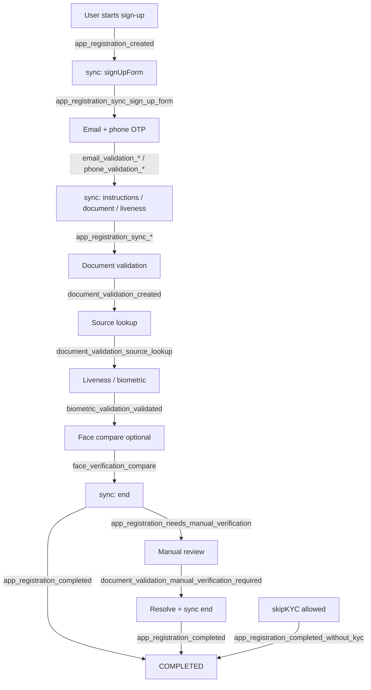

# Supported Events

## Overview

This page lists webhook **event suffixes** Verifik can emit. Your HTTP listener receives a **`type`** built as **`${projectFlow.type}_${suffix}`** (for Smart Enroll flows, `projectFlow.type` is usually `onboarding`, so you see `onboarding_email_validation_created`, not only `email_validation_created`).

**Spanish:** [Eventos soportados](/verifik-es/resources/eventos-soportados).

:::info HTTP request body

Every delivery is an HTTP **POST** to your ProjectFlow webhook URL with JSON:

```json
{
  "type": "onboarding_email_validation_created",
  "object": { }
}
```

- **`type`** — Full string: **`${projectFlow.type}_${suffix}`**. Match on this value in your code.
- **`object`** — Primary entity snapshot (IDs and fields). **OTP values are stripped** before send.

Nothing is queued if the flow has **no** webhook or the code path does not attach one.

:::

:::tip Quick rule

Tables below show the **`suffix`** only. Your logs will show the **prefixed** `type` (e.g. `onboarding_…` or `login_…`).

:::

### Typical onboarding timeline

Order varies by project (optional steps, skip KYC, gateways). This diagram shows a **common** happy path and where major events appear. Parallel steps (email vs phone) are simplified.



:::warning Manual verification vs completed

If the registration or document is in **`NEEDS_MANUAL_VERIFICATION`**, **`sync`** with `step: "end"` may emit **`app_registration_needs_manual_verification`** instead of **`app_registration_completed`** until blockers are cleared. A second **`completed`** event can arrive later after resolution and another **`sync`** (or **`adminOverride`**). Real delivery order over the network can differ by milliseconds.

:::

---
