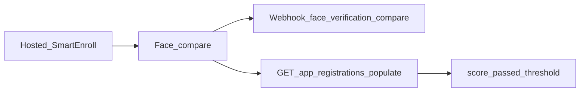

# SmartEnroll API Companion
**API path(s):** /v2/app-registrations/{id}

## Flow overview

After a user completes **hosted SmartEnroll** KYC, use this guide to pull results into your backend: face-match scores, liveness, webhooks, and the endpoints that matter. This is a companion to the product docs—not a full rewrite of the [self-hosted SmartEnroll API](/smart-enroll-self-hosted).

## Flow overview



1. The end user finishes document + biometric steps in the hosted flow.
2. Verifik runs face comparison (selfie vs document face) using your project thresholds.
3. You receive a webhook (if configured) and/or poll the app registration with populates.
4. You apply your business rules using `score`, `passed`, and `compare_min_score`.

## Reading face-comparison scores

There is **no** public `GET /v2/face-verifications/:id`. Face scores live on the `FaceVerification` linked from the app registration.

```
GET https://api.verifik.co/v2/app-registrations/{id}?populates[]=compareFaceVerification
```

Useful fields on the populated object:

| Field | Meaning |
| --- | --- |
| `compareFaceVerification.result.score` | Similarity score (0–1) |
| `compareFaceVerification.result.passed` | Whether the score met the effective threshold |
| `compareFaceVerification.result.compare_min_score` | Threshold used for that compare |
| `compareFaceVerification.comparedAt` | When the compare ran |

**TTL:** FaceVerification records expire after about **90 days** in production (**10 days** in development). After expiry, `compareFaceVerification` may be empty even if the app registration remains.

Also see [Get App Registration](/resources/app-registrations/retrieve-an-app-registration).
