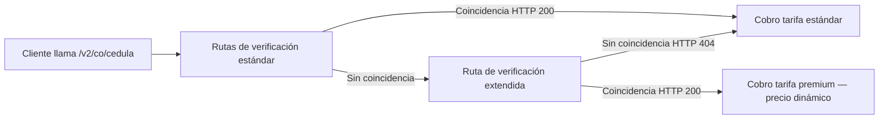

# Ciudadano Colombiano
**API path(s):** /v2/co/cedula

## Parámetros

| Name             | Type   | Required | Description                                  |
| ---------------- | ------ | -------- | -------------------------------------------- |
| `documentType`   | string | Sí       | Uno de **`CC`**, **`CE`**, **`PPT`**, **`NIT`**, **`PEP`**. Ver la [guía de documentos](/verifik-es/validacion-identidad/colombia/guia-documentos-identidad-colombia). |
| `documentNumber` | string | Sí       | Número del documento, **solo dígitos** (sin espacios ni puntos). **5–10** caracteres (validación API). La CC suele tener **8** o **10** dígitos; el PPT suele tener **hasta 7** en registros oficiales. Ejemplo: `1032386359`. |

### Precio dinámico {#dynamic-pricing}

Este endpoint participa en la arquitectura de **Consulta Dinámica** de Verifik. En la mayoría de los casos pagas la **tarifa estándar** de `/v2/co/cedula`. Cuando las rutas de verificación estándar no devuelven coincidencia, puede ejecutarse automáticamente una **ruta de verificación extendida**. Si esa ruta devuelve **HTTP 200**, aplica **precio dinámico** y los créditos se deducen en el **nivel premium** de esta familia de endpoints, no en el nivel estándar.

**Expectativa de precio:** Desde tu **tarifa estándar** · hasta **tarifa premium** (consulta tu plan, Postman o el panel de cliente).



**Transparencia de facturación (opcional):** envía el parámetro de consulta **`includeCost=true`**. Cuando se cobren créditos, la respuesta puede incluir un objeto **`billing`** si aplica precio dinámico:

```json
"billing": {
  "dynamicQueryApplied": true,
  "adjustmentType": "dynamic_query_premium",
  "standardCredits": 0.3,
  "chargedCredits": 2,
  "standardFeatureCode": "colombia_api_identity_lookup",
  "billedFeatureCode": "colombia_api_identity_lookup_premium"
}
```

Los montos son **ilustrativos**; los valores reales dependen de tu plan.

- **SLA:** [Precio dinámico (facturación)](/verifik-es/acuerdo-de-niveles-de-servicio#dynamic-pricing-billing)
- **Ruta premium directa:** Contacta a soporte de Verifik para la documentación de la ruta premium explícita. Siempre usa tarificación premium.
