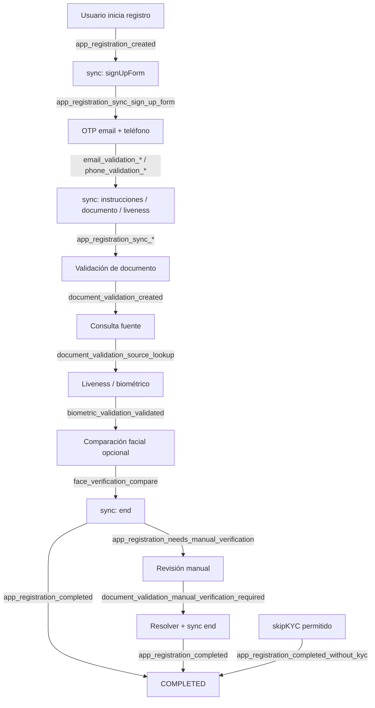

# Eventos soportados

## Descripción general

Aquí se listan los **sufijos** de eventos que Verifik puede emitir. Tu endpoint recibe un **`type`** armado como **`${projectFlow.type}_${sufijo}`** (en Smart Enroll suele ser `onboarding`, p. ej. `onboarding_email_validation_created`).

**English:** [Supported Events](/resources/supported-events).

:::info Cuerpo HTTP

Cada envío es un **POST** HTTP a la URL del webhook del **ProjectFlow** con JSON:

```json
{
  "type": "onboarding_email_validation_created",
  "object": { }
}
```

- **`type`** — Cadena completa: **`${projectFlow.type}_${sufijo}`**. Haz match con este valor.
- **`object`** — Copia de la entidad principal. Los **OTP** se eliminan antes del envío.

Si el flujo **no** tiene webhook o la ruta no lo asocia, **no** se encola el evento.

:::

:::tip Regla rápida

Las tablas muestran solo el **`sufijo`**. En logs verás el **`type` con prefijo** (`onboarding_…`, `login_…`, etc.).

:::

### Línea de tiempo típica de onboarding

El orden real depende del proyecto (pasos opcionales, omitir KYC, gateways). El diagrama resume un **camino feliz** habitual y dónde aparecen los eventos principales. Pasos paralelos (email vs teléfono) están simplificados.



:::warning Verificación manual vs completado

Si el registro o el documento está en **`NEEDS_MANUAL_VERIFICATION`**, un **`sync`** con paso `end` puede emitir **`app_registration_needs_manual_verification`** en lugar de **`app_registration_completed`** hasta desbloquear. Más tarde puede llegar **`completed`** tras otra acción (**`sync`** o **`adminOverride`**). El orden real en red puede variar en milisegundos.

:::

---
