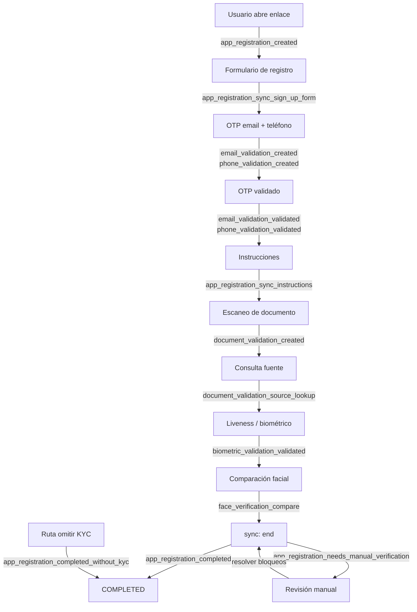

# Webhooks de Smart Enroll (KYC)

## Línea de tiempo de Smart Enroll

El orden varía según el proyecto (pasos opcionales, omitir KYC, gateways). El diagrama muestra un **camino feliz** frecuente y dónde se emiten los eventos principales.

---

### Eventos del ciclo de vida en orden

La tabla lista los eventos en el **orden típico** en que se emiten durante un flujo Smart Enroll.

| # | Sufijo | Cuándo se emite | Notas |
| --- | --- | --- | --- |
| 1 | `app_registration_created` | Se crea el registro (insert) | Incluye contexto `projectFlow` |
| 2 | `app_registration_sync_sign_up_form` | Formulario enviado vía **sync** | Estado sigue `ONGOING` |
| 3 | `email_validation_created` | Primer envío de OTP por email | |
| 3a | `email_validation_resend` | Reenvío con OTP previo aún vigente | |
| 3b | `email_validation_validated` | OTP correcto | |
| 3c | `email_validation_otp_incorect` | OTP incorrecto | Ortografía coincide con API |
| 4 | `phone_validation_created` | Primer OTP (SMS / WhatsApp) | |
| 4a | `phone_validation_resend` | Reenvío misma validación | |
| 4b | `phone_validation_validated` | OTP correcto | |
| 4c | `phone_validation_otp_incorect` | OTP incorrecto | |
| 5 | `app_registration_sync_instructions` | Paso instrucciones vía **sync** | Estado sigue `ONGOING` |
| 6 | `document_validation_created` | Inicia validación de documento | Puede incluir `appRegistration`, `email`, `phone` |
| 7 | `document_validation_source_lookup` | Consulta a fuente / gobierno completa | |
| 7a | `document_validation_data_source_error` | Respuesta inválida o nombre no coincide | Puede incluir `notSupportedData` |
| 8 | `biometric_validation_validated` | Liveness aprobado | |
| 8a | `biometric_validation_liveness_failed` | Liveness falla | |
| 8b | `biometrics_liveness_score_not_acceptable` | Score bajo el umbral del proyecto | |
| 9 | `face_verification_compare` | Comparación facial (selfie vs documento) | Incluye `compareResult` |
| 10 | `document_validation_manual_verification_required` | Documento pasa a revisión manual | Bloquea `COMPLETED` |
| 11 | **`app_registration_completed`** | **sync** `end` — requisitos cumplidos | Evento final exitoso |
| 11 | **`app_registration_needs_manual_verification`** | **sync** `end` — quedan bloqueos | Ver advertencia abajo |
| 11 | **`app_registration_completed_without_kyc`** | Ruta **skipKYC**, flujo lo permite | |
| 11 | **`app_registration_failed`** | **sync** `end` — completitud = `FAILED` | |

---
