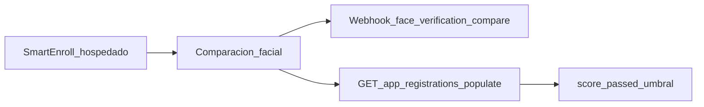

# SmartEnroll — Guía de API
**API path(s):** /v2/app-registrations/:id, /v2/app-registrations/:id/resend-link, /v2/app-registrations/{id}, /v2/biometric-validations/app-registration, /v2/document-validations/app-registration, /v2/face-recognition/compare, /v2/face-recognition/compare-with-liveness, /v2/face-recognition/compare/app-registration, /v2/face-recognition/liveness, /v2/face-recognition/liveness-score, /v2/face-verifications/:id, /v2/identity-images/appregistration

## Resumen del flujo

Tras completar el KYC de **SmartEnroll hospedado**, usa esta guía para integrar resultados en tu backend: scores de comparación facial, vitalidad, webhooks y los endpoints relevantes. Es un complemento a la documentación de producto—no sustituye la [API de SmartEnroll autoalojado](/verifik-es/smart-enroll-auto-alojado).

## Resumen del flujo



1. El usuario final completa documento + biometría en el flujo hospedado.
2. Verifik ejecuta la comparación facial (selfie vs cara del documento) con los umbrales de tu proyecto.
3. Recibes un webhook (si está configurado) y/o consultas el app registration con populates.
4. Aplicas tus reglas de negocio con `score`, `passed` y `compare_min_score`.

## Leer scores de comparación facial

**No existe** un `GET /v2/face-verifications/:id` público. Los scores viven en el `FaceVerification` enlazado desde el app registration.

```
GET https://api.verifik.co/v2/app-registrations/{id}?populates[]=compareFaceVerification
```

Campos útiles en el objeto populado:

| Campo | Significado |
| --- | --- |
| `compareFaceVerification.result.score` | Score de similitud (0–1) |
| `compareFaceVerification.result.passed` | Si el score cumplió el umbral efectivo |
| `compareFaceVerification.result.compare_min_score` | Umbral usado en esa comparación |
| `compareFaceVerification.comparedAt` | Cuándo se ejecutó la comparación |

**TTL:** Los registros FaceVerification expiran en unos **90 días** en producción (**10 días** en desarrollo). Tras expirar, `compareFaceVerification` puede venir vacío aunque el app registration siga existiendo.

Consulta también la documentación de app registrations en Resources (Get App Registration).
